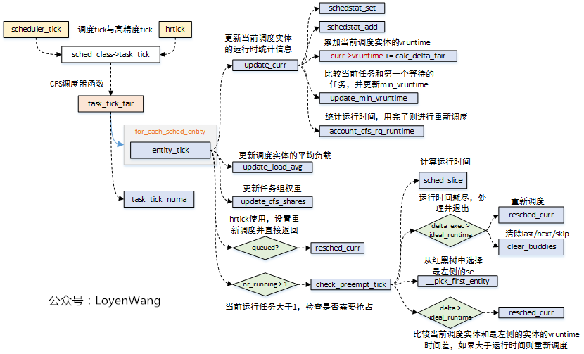

## `Completely Fair Scheduler`代码分析

### 作业内容

阅读 OpenEuler kernel-4.19中与完全公平调度算法 (Completely Fair Scheduler)相关的代码kernel/sched/fair.c，分析CFS的具体实现过程，思考CFS相比 Scheduler的优势 。

### 作业目标

1. 阅读助教大作业指南`/include/linux/sched.h`、`kernel/sched/sched.h  `、`kernel/sched/core.c  `、` kernel/sched/fair.c` 等与cfs调度有关的源码相关文件。
2. 分析CFS的具体实现过程。
3. 思考CFS的优势。

### 概念介绍

#### CFS简介

Linux从2.6.23版本正式使用`CFS`（完全公平调度器）替代之前`O(1)`调度器作为普通进程的调度器，在操作系统课程上我们学习过公平共享调度策略，这个策略保证每个任务可以根据自己占有的份额共享`CPU`时间，这是`CFS`调度的基本思想。

`CFS`采用了红黑树算法来管理所有的调度实体`sched_entity`，算法插入效率为`O(log(n))`。`CFS`跟踪调度实体`sched_entity`的虚拟运行时间`vruntime`，平等对待运行队列中的调度实体`sched_entity`，将执行时间少的调度实体`sched_entity`排列到红黑树的左边。

调度实体`sched_entity`通过`enqueue_entity()`和`dequeue_entity()`来进行红黑树的出队和入队。

#### 调度器

Linux中含有5种调度器，`sched_class`是基类。其中的`cfs_sched_class` ：完全公平调度器类，是此次报告的分析对象。

#### runqueue 运行队列  

每一个CPU拥有一个相对应的`rq`,其中指向了三个不同的调度队列，包含CFS调度队列。此处助教的作业指导中已经写得很清楚。

#### cfs_rq

Linux使用`strcut cfs_rq`描述CFS调度的运行队列，结构体中包含了`struct rb_root_cached`红黑树，用于调度实体`struct sched_entity`。

另外，虽然`rq`运行队列中对应了一个CFS运行队列，但在`task_group`结构中也会为每个CPU再维护一个CFS运行队列；

```c
/* CFS-related fields in a runqueue */
struct cfs_rq {
	struct load_weight	load;
    /*
	 * nr_running: how many entity would take part in the sharing the cpu power of that cfs_rq
	 * h_nr_running: how many tasks in current cfs runqueue
	*/
	unsigned long		runnable_weight;
	unsigned int		nr_running;
	unsigned int		h_nr_running;      /* SCHED_{NORMAL,BATCH,IDLE} */
	unsigned int		idle_h_nr_running; /* SCHED_IDLE */
	u64			exec_clock; /* 运行时间 */
	u64			min_vruntime; /* 最少虚拟时间 */
#ifndef CONFIG_64BIT
	u64			min_vruntime_copy;
#endif

	struct rb_root_cached	tasks_timeline; /* 指向红黑树的根节点，用于存放调度实体 */

	/*
	 * 'curr' points to currently running entity on this cfs_rq.
	 * It is set to NULL otherwise (i.e when none are currently running).
	 */
    /* 字面意思的理解，目前、下一个、最后、跳过运行的实体*/
	struct sched_entity	*curr;
	struct sched_entity	*next;
	struct sched_entity	*last;
	struct sched_entity	*skip;

#ifdef	CONFIG_SCHED_DEBUG
	unsigned int		nr_spread_over;
#endif

#ifdef CONFIG_SMP
	/*
	 * CFS load tracking
	 */
	struct sched_avg	avg; /* 计算负载 */
#ifndef CONFIG_64BIT
	u64			load_last_update_time_copy;
#endif
	struct {
		raw_spinlock_t	lock ____cacheline_aligned;
		int		nr;
		unsigned long	load_avg;
		unsigned long	util_avg;
		unsigned long	runnable_sum;
	} removed;

#ifdef CONFIG_FAIR_GROUP_SCHED
	unsigned long		tg_load_avg_contrib; /* task_group 负载贡献值 */
	long			propagate;
	long			prop_runnable_sum;

	/*
	 *   h_load = weight * f(tg)
	 *
	 * Where f(tg) is the recursive weight fraction assigned to
	 * this group.
	 */
	unsigned long		h_load;
	u64			last_h_load_update;
	struct sched_entity	*h_load_next;
#endif /* CONFIG_FAIR_GROUP_SCHED */
#endif /* CONFIG_SMP */

#ifdef CONFIG_FAIR_GROUP_SCHED
    /* 反向指回 rq 运行队列 */
	struct rq		*rq;	/* CPU runqueue to which this cfs_rq is attached */

	/*
	 * leaf cfs_rqs are those that hold tasks (lowest schedulable entity in
	 * a hierarchy). Non-leaf lrqs hold other higher schedulable entities
	 * (like users, containers etc.)
	 *
	 * leaf_cfs_rq_list ties together list of leaf cfs_rq's in a CPU.
	 * This list is used during load balance.
	 */
	int			on_list;
	struct list_head	leaf_cfs_rq_list; /* 运行链表 */
	struct task_group	*tg;	/* group that "owns" this runqueue */

#ifdef CONFIG_CFS_BANDWIDTH
	int			runtime_enabled;
	s64			runtime_remaining;
	u64			throttled_clock;
	u64			throttled_clock_task;
	u64			throttled_clock_task_time;
	int			throttled;
	int			throttle_count;
	struct list_head	throttled_list;
#endif /* CONFIG_CFS_BANDWIDTH */
#endif /* CONFIG_FAIR_GROUP_SCHED */
};
```

#### task_group

一般来说，调度器对单个任务进行操作。但有时可能需要对任务进行分组，并为每个任务组提供公平的CPU时间。Linux引入任务分组的机制， 将任务分组来对CPU资源进行分配管理，该结构中为系统中的每个CPU都分配了`struct sched_entity`调度实体和`struct cfs_rq`运行队列，其中`struct sched_entity`用于参与CFS的调度；

#### task_struct

线程和进程描述块，之前学习进程与线程时已经了解过，结构体包含`struct sched_entity`调度实体，用于参与CFS调度。

#### sched_entity

调度实体，CFS调度管理的对象。

```c
struct sched_entity {
	/* For load-balancing: */
    struct load_weight		load; /* 调度实体的权重 */
	unsigned long			runnable_weight; /* 正在运行的计算权重 */
	struct rb_node			run_node; /* 此调度实体在红黑树中的部分 */
	struct list_head		group_node; /* 链接到cfs_rq中的leaf_cfs_rq_list链表 */
	unsigned int			on_rq; /* 是否在运行队列中 */

	u64				exec_start; /* 当前调度实体开始运行时间 */
	u64				sum_exec_runtime;/* 执行期间总时间 */
	u64				vruntime; /* 虚拟运行时间，代表任务经过的虚拟时间，利用这个时间在cfs运行队列中进行排队*/
	u64				prev_sum_exec_runtime; /* 上一个任务执行的运行时间 */

	u64				nr_migrations;/* 负载均衡 */

	struct sched_statistics		statistics; /* 调度统计信息 */

#ifdef CONFIG_FAIR_GROUP_SCHED
	int				depth;
	struct sched_entity		*parent;
	/* rq on which this entity is (to be) queued: */
	struct cfs_rq			*cfs_rq;
	/* rq "owned" by this entity/group: */
	struct cfs_rq			*my_q;
#endif

#ifdef CONFIG_SMP
	/*
	 * Per entity load average tracking.
	 *
	 * Put into separate cache line so it does not
	 * collide with read-mostly values above.
	 */
	struct sched_avg		avg;
#endif
};
```

### CFS调度过程

每一个调度类都需要实现相关的调度有关的函数，根据实验指导的建议，我的过程分析将围绕不同的调度方式，分析该调度方式中调用的`fair_sched_class`中的函数，以及函数的部分含义。

```c
const struct sched_class fair_sched_class = {
	.next			= &idle_sched_class,
	.enqueue_task		= enqueue_task_fair, /* 可运行状态，入队 */
	.dequeue_task		= dequeue_task_fair, /* 退出可运行状态，出队 */
	.yield_task		= yield_task_fair, /* 自愿放弃CPU，但是仍然是可运行状态 */
	.yield_to_task		= yield_to_task_fair, 
	.check_preempt_curr	= check_preempt_wakeup, /* 判断新进程是否可以抢占当前进程 */
	.pick_next_task		= pick_next_task_fair,/* 使用完全公平算法挑选下一个task */
	.put_prev_task		= put_prev_task_fair, /* 把当前进程加入到红黑树中 */
	.set_next_task          = set_next_task_fair, /* 挑选下一个task */

#ifdef CONFIG_SMP
	.balance		= balance_fair,
	.select_task_rq		= select_task_rq_fair,
	.migrate_task_rq	= migrate_task_rq_fair,
	.rq_online		= rq_online_fair,
	.rq_offline		= rq_offline_fair,
	.task_dead		= task_dead_fair,
	.set_cpus_allowed	= set_cpus_allowed_common,
#endif
	.task_tick		= task_tick_fair,/* 每次时钟中断时，由scheduler_tick()调用 */
	.task_fork		= task_fork_fair,/* 父进程通过fork创建子进程，确定子任务的vruntime */

	.prio_changed		= prio_changed_fair,
	.switched_from		= switched_from_fair,
	.switched_to		= switched_to_fair,

	.get_rr_interval	= get_rr_interval_fair,
	/* 更新运行队列 */
	.update_curr		= update_curr_fair,
#ifdef CONFIG_FAIR_GROUP_SCHED
	.task_change_group	= task_change_group_fair,
#endif

#ifdef CONFIG_UCLAMP_TASK
	.uclamp_enabled		= 1,
#endif
};
```

#### 前置分析

由于几乎每一个调度工作都会用到`update_curr()`,在此先分析CFS的权重计算等工作。

在CFS调度中，Linux静态设置了`Niceness`与任务权重`(weight)`，`niceness`越低则任务权重越高，可被分配的CPU时间越多。为了避免静态设置任务时间片带来的问题，CFS调度使用调度周期的概念(`sched_period`)的概念，保证每经过一个调度周期，运行队列中的任务都会调度一次。调度周期被设置为运行队列中所有任务各执行一个时间片所需要的的总时间，每个任务的CPU时间占比相当于该任务在一个调度周期内的运行时间在该周期的占比。

调度周期默认值为`sched_latency`为6毫秒，但是Linux也对其他情况做了处理，在此不展开说了。

调度器计算当前运行队列中，第i个任务的动态时间片`time_slice_i`:
$$
time\_slice\_i = sched\_period*\frac{weight\_i}{weight\_rq}
$$
其中，$weight\_i$代表第$i$个任务的权重，$weight\_rq$代表当前运行队列中任务权重之和。

另外，由于每一个任务的时间片不同，根据任务权重做了缩放，所以任务每次执行后对vruntime进行更新时也要进行缩放。
$$
vruntime\_i = vruntime\_i+\frac{weight\_nice0}{weight\_i}*real\_runtime
$$
其中，$weight\_nice0$ 与$weight\_i$的比值是一个系数，用于将实际运行的物理时间($real\_runtime$)映射为虚拟时间。

下面的源代码是`update_curr`函数：

```c
static void update_curr(struct cfs_rq *cfs_rq)
{
	struct sched_entity *curr = cfs_rq->curr;
	u64 now = rq_clock_task(rq_of(cfs_rq));
	u64 delta_exec;
	if (unlikely(!curr))
		return;

	delta_exec = now - curr->exec_start;
	if (unlikely((s64)delta_exec <= 0))
		return;
	/* 更新开始的时间 */
	curr->exec_start = now;
	schedstat_set(curr->statistics.exec_max,
		      max(delta_exec, curr->statistics.exec_max));
	/* 更新总的运行时间 */
	curr->sum_exec_runtime += delta_exec;
	schedstat_add(cfs_rq->exec_clock, delta_exec);
	/* 利用公式计算新的vruntime */
	curr->vruntime += calc_delta_fair(delta_exec, curr);
	update_min_vruntime(cfs_rq); // 更新最小的vruntime值

	if (entity_is_task(curr)) {
		struct task_struct *curtask = task_of(curr);
		trace_sched_stat_runtime(curtask, delta_exec, curr->vruntime);
		cgroup_account_cputime(curtask, delta_exec);
		account_group_exec_runtime(curtask, delta_exec);
	}
	account_cfs_rq_runtime(cfs_rq, delta_exec);
}
```

从网上找的此函数分析图：


#### 主动调度——`schedule()`

在`/kernel/sched/core.c`中可以找到该函数，preempt_disable():避免进程抢占，发现这个函数又调用了`__schedule(false)`，找到该函数，已经贴在下面，可以发现在里面调用了 `pick_next_task`,继续找,得到在这里调用了,`fair_sched_class.pick_next_task`与`sched_class->put_prev_task`,所以可以分析有关于主动调度相关的`pick_next_task_fair`,`put_prev_task_fair`,`set_next_task_fair`,三个函数了。

其中在`pick_next_task_fair`函数中会调用`update_curr`函数进行红黑树的更新，当需要进程任务切换的时候，`pick_next_task_fair`函数的传入参数中包含了需要被切换出去的任务，也就是`pre_task`；

当`pre_task`不是普通进程时，也就是调度类不是CFS，那么它就不使用`sched_entity`的调度实体来参与调度，因此会执行`simple`分支，通过`put_pre_task`函数来通知系统当前的任务需要被切换，而不是通过`put_prev_entity`函数来完成；

当`pre_task`是普通进程时，调用`pick_next_entity`来选择下一个执行的调度实体,在这个函数中会直接调用`__pick_next_entity`函数，选在红黑树的最左节点，也就是vruntime最小的节点。在运行这个函数前有两种情况需要判断：当调度实体对应task时，`do while()`遍历一次，当调度实体对应`task_group`是，则需要遍历任务组来选择下一个执行的任务。

`put_prev_entity`，把当前进程加入到红黑树中，使用`__enqueue_entity`函数，用于切换任务前的准备工作，更新运行时的统计数据，需要将CFS队列的`curr`指针置位成NULL；

`set_next_entity`用于设置下一个要运行的调度实体，设置CFS队列的`curr`指针，使用`__dequeue_entity`函数，将新选出的即将运行的进程移出红黑树；


```c
static void __sched notrace __schedule(bool preempt)
{
	struct task_struct *prev, *next;
	unsigned long *switch_count;
	struct rq_flags rf;
	struct rq *rq;
	int cpu;

	cpu = smp_processor_id();
	rq = cpu_rq(cpu);
	prev = rq->curr;
	/* ... *

	rq_lock(rq, &rf);
	smp_mb__after_spinlock();

	/* Promote REQ to ACT */
	rq->clock_update_flags <<= 1;
	update_rq_clock(rq);
	/* ... */
	next = pick_next_task(rq, prev, &rf); //找到下一个进程
	clear_tsk_need_resched(prev);
	clear_preempt_need_resched();

	/* ... */

	balance_callback(rq);
}
```

```c
static inline struct task_struct *
pick_next_task(struct rq *rq, struct task_struct *prev, struct rq_flags *rf)
{
	const struct sched_class *class;
	struct task_struct *p;
	if (likely((prev->sched_class == &idle_sched_class ||
		    prev->sched_class == &fair_sched_class) &&
		   rq->nr_running == rq->cfs.h_nr_running)) {
		p = fair_sched_class.pick_next_task(rq, prev, rf);
		if (unlikely(p == RETRY_TASK))
			goto restart;
		/* Assumes fair_sched_class->next == idle_sched_class */
		if (unlikely(!p))
			p = idle_sched_class.pick_next_task(rq, prev, rf);
		return p;
	}
restart:
	/* ... */
    put_prev_task(rq, prev);
    /* ... */
	BUG();
}
```

`pick_next_task_fair`源码如下：

```c
static struct task_struct *
pick_next_task_fair(struct rq *rq, struct task_struct *prev, struct rq_flags *rf)
{
	struct cfs_rq *cfs_rq = &rq->cfs;
	struct sched_entity *se;
	struct task_struct *p;
	int new_tasks;
again:
	if (!sched_fair_runnable(rq))
		goto idle;

#ifdef CONFIG_FAIR_GROUP_SCHED
	if (!prev || prev->sched_class != &fair_sched_class)
		goto simple;

	/*
	 * Because of the set_next_buddy() in dequeue_task_fair() it is rather
	 * likely that a next task is from the same cgroup as the current.
	 *
	 * Therefore attempt to avoid putting and setting the entire cgroup
	 * hierarchy, only change the part that actually changes.
	 */

	do {
		struct sched_entity *curr = cfs_rq->curr;

		/*
		 * Since we got here without doing put_prev_entity() we also
		 * have to consider cfs_rq->curr. If it is still a runnable
		 * entity, update_curr() will update its vruntime, otherwise
		 * forget we've ever seen it.
		 */
		if (curr) {
			if (curr->on_rq)
				update_curr(cfs_rq);
			else
				curr = NULL;

			/*
			 * This call to check_cfs_rq_runtime() will do the
			 * throttle and dequeue its entity in the parent(s).
			 * Therefore the nr_running test will indeed
			 * be correct.
			 */
			if (unlikely(check_cfs_rq_runtime(cfs_rq))) {
				cfs_rq = &rq->cfs;

				if (!cfs_rq->nr_running)
					goto idle;

				goto simple;
			}
		}
		se = pick_next_entity(cfs_rq, curr);/* 调用选择下一个调度实体的函数 */
		cfs_rq = group_cfs_rq(se);
	} while (cfs_rq);

	p = task_of(se);

	/*
	 * Since we haven't yet done put_prev_entity and if the selected task
	 * is a different task than we started out with, try and touch the
	 * least amount of cfs_rqs.
	 */
	if (prev != p) {
		struct sched_entity *pse = &prev->se;

		while (!(cfs_rq = is_same_group(se, pse))) {
			int se_depth = se->depth;
			int pse_depth = pse->depth;

			if (se_depth <= pse_depth) {
				put_prev_entity(cfs_rq_of(pse), pse);
				pse = parent_entity(pse);
			}
			if (se_depth >= pse_depth) {
				set_next_entity(cfs_rq_of(se), se);
				se = parent_entity(se);
			}
		}

		put_prev_entity(cfs_rq, pse);
		set_next_entity(cfs_rq, se);
	}

	goto done;
simple:
#endif
	if (prev)
		put_prev_task(rq, prev);

	do {
		se = pick_next_entity(cfs_rq, NULL);
		set_next_entity(cfs_rq, se);
		cfs_rq = group_cfs_rq(se);
	} while (cfs_rq);

	p = task_of(se);

done: __maybe_unused;
#ifdef CONFIG_SMP
	/*
	 * Move the next running task to the front of
	 * the list, so our cfs_tasks list becomes MRU
	 * one.
	 */
	list_move(&p->se.group_node, &rq->cfs_tasks);
#endif

	if (hrtick_enabled(rq))
		hrtick_start_fair(rq, p);

	update_misfit_status(p, rq);

	return p;

idle:
	if (!rf)
		return NULL;

	new_tasks = newidle_balance(rq, rf);

	/*
	 * Because newidle_balance() releases (and re-acquires) rq->lock, it is
	 * possible for any higher priority task to appear. In that case we
	 * must re-start the pick_next_entity() loop.
	 */
	if (new_tasks < 0)
		return RETRY_TASK;

	if (new_tasks > 0)
		goto again;

	/*
	 * rq is about to be idle, check if we need to update the
	 * lost_idle_time of clock_pelt
	 */
	update_idle_rq_clock_pelt(rq);

	return NULL;
}
```

这张图片是我从网上看到的一张流程图，非常准确而且易于理解，我放在了这里。


这个是`pick_next_entity`函数，用于选择下一个调度实体，调用`__pick_first_entity`获得红黑树中vruntime最小的实体。


#### 周期调度——`scheduler_tick()`

阅读`/kernel/sched/core.c`源码可以看到调用过程：`scheduler_tick()->shed_class->task_tick()->task_tick_fair()->entity_tick()`,可以对`entity_tick()`加以分析：


下面是`entity_tick`函数源代码

```c
static void
entity_tick(struct cfs_rq *cfs_rq, struct sched_entity *curr, int queued)
{
	/*
	 * Update run-time statistics of the 'current'.
	 */
	update_curr(cfs_rq);
	/* ... */
	if (cfs_rq->nr_running > 1)
		check_preempt_tick(cfs_rq, curr); /* 判断是否需要设置重新调度标志 */
}
```
这是我在网上找的一个CFS关于周期调度的运行过程，可以作为参考。



#### 进程唤醒调度——`wake_up_process  `

阅读`/kernel/sched/core.c`源码可以看到调用过程为：`wake_up_process()->try_to_wake_up()->ttwu_queue()->ttwu_do_activate()->activate_task()->enqueue_task()->sched_class->enqueue_task()->enqueue_task_fair()->enqueue_entity()->__enqueue_entity()`，上面即是进程唤醒调度的主要调用函数，使用`enqueue_entity`改变进程的`vruntime`值，最终调用`__enqueue_entity`将调度实体加入红黑树队列中，等待调度。下面有源码。


```c
static void
enqueue_entity(struct cfs_rq *cfs_rq, struct sched_entity *se, int flags)
{
	bool renorm = !(flags & ENQUEUE_WAKEUP) || (flags & ENQUEUE_MIGRATED);
	bool curr = cfs_rq->curr == se;

	/*
	 * If we're the current task, we must renormalise before calling
	 * update_curr().
	 */
	if (renorm && curr)
	/* 处理vruntime的值 */
	se->vruntime += cfs_rq->min_vruntime;

	update_curr(cfs_rq);
	/*
	 * Otherwise, renormalise after, such that we're placed at the current
	 * moment in time, instead of some random moment in the past. Being
	 * placed in the past could significantly boost this task to the
	 * fairness detriment of existing tasks.
	 */
	if (renorm && !curr)/* 处理vruntime的值 */
		se->vruntime += cfs_rq->min_vruntime;
	/*
	 * When enqueuing a sched_entity, we must:
	 *   - Update loads to have both entity and cfs_rq synced with now.
	 *   - Add its load to cfs_rq->runnable_avg
	 *   - For group_entity, update its weight to reflect the new share of
	 *     its group cfs_rq
	 *   - Add its new weight to cfs_rq->load.weight
	 */
	update_load_avg(cfs_rq, se, UPDATE_TG | DO_ATTACH);
	update_cfs_group(se);
	enqueue_runnable_load_avg(cfs_rq, se);
	account_entity_enqueue(cfs_rq, se);

	if (flags & ENQUEUE_WAKEUP)
		place_entity(cfs_rq, se, 0);

	check_schedstat_required();
	update_stats_enqueue(cfs_rq, se, flags);
	check_spread(cfs_rq, se);
	if (!curr)
		__enqueue_entity(cfs_rq, se);
	se->on_rq = 1;
	/*
	 * When bandwidth control is enabled, cfs might have been removed
	 * because of a parent been throttled but cfs->nr_running > 1. Try to
	 * add it unconditionnally.
	 */
	if (cfs_rq->nr_running == 1 || cfs_bandwidth_used())
		list_add_leaf_cfs_rq(cfs_rq);

	if (cfs_rq->nr_running == 1)
		check_enqueue_throttle(cfs_rq);
}
```

#### 进程创建时调度——`sched_fork()`

跟前面一样，阅读源码，可以找到，调用链为`sched_fork()-> task_fork_fair()->place_entity()`。`task_fork_fair()`函数主要是设置新进程的vruntime值，`place_entity()`再次调整新进程的vruntime值。


`task_fork_fair()`源代码与相关注释如下：

```c
static void task_fork_fair(struct task_struct *p)
{
	struct cfs_rq *cfs_rq;
	struct sched_entity *se = &p->se, *curr;
	struct rq *rq = this_rq();
	struct rq_flags rf;

	rq_lock(rq, &rf);
	update_rq_clock(rq);

	cfs_rq = task_cfs_rq(current);
	curr = cfs_rq->curr;
	if (curr) {
		update_curr(cfs_rq);//更新当前进程的vruntime值
		se->vruntime = curr->vruntime; //以父进程的vruntime为基础
	}
	place_entity(cfs_rq, se, 1); //设置新进程的vruntime值,1表示是新进程
	if (sysctl_sched_child_runs_first && curr && entity_before(curr, se)) {
		/*
		 * Upon rescheduling, sched_class::put_prev_task() will place
		 * 'current' within the tree based on its new key value.
		 */
		swap(curr->vruntime, se->vruntime);
		resched_curr(rq);
	}
	se->vruntime -= cfs_rq->min_vruntime;
	rq_unlock(rq, &rf);
}
```

```c
static void
place_entity(struct cfs_rq *cfs_rq, struct sched_entity *se, int initial)
{
	u64 vruntime = cfs_rq->min_vruntime;
	/*
	 * The 'current' period is already promised to the current tasks,
	 * however the extra weight of the new task will slow them down a
	 * little, place the new task so that it fits in the slot that
	 * stays open at the end.
	 */
	if (initial && sched_feat(START_DEBIT))
		vruntime += sched_vslice(cfs_rq, se); //sched_vslice函数,计算一个调度周期内新进程的vruntime值
	/* sleeps up to a single latency don't count. */
	if (!initial) {
		unsigned long thresh = sysctl_sched_latency;

		/*
		 * Halve their sleep time's effect, to allow
		 * for a gentler effect of sleepers:
		 */
		if (sched_feat(GENTLE_FAIR_SLEEPERS))
			thresh >>= 1;

		vruntime -= thresh;
	}
	/* ensure we never gain time by being placed backwards. */
	se->vruntime = max_vruntime(se->vruntime, vruntime);
}
```

### 思考分析

#### O(1)算法简介

由于O(n)调度器存在调度开销过大、多核扩展性差等原因，Linux在2.6.0版本中采用了新的O(1)调度器替换之。该调度器采用两级调度的思想，每一个CPU核心单独维护一个本地队列，让任务仅在同一个核心上进行调度。每个本地队列实际上由两级队列——激活队列和过期队列组成，分别用于管理仍有时间片剩余的任务和时间片耗尽的任务。如果时间片耗尽，会被加入过期队列中。

每个多级队列都有140个优先级，其中高优先级[0,100)对应于实时任务，剩下的对应不同的Niceness的非实时任务。每个队列维护一个位图，位图中的比特位用于判断对应的优先级队列是否有任务等待调度。在进行调度决策时，O(1)调度器会根据位图找到激活队列中第一个不为空的队列，调度该队列中第一个任务，时间复杂度为O(1)，与运行队列中的任务数量无关。

O(1)调度器的开销很小，大部分场景都能够获得不错的性能，但是仍然有一些弊端。

#### 对比分析

O(1)调度器的一些弊端

- 交互式任务的判定算法较为复杂

  O(1)调度器为了保证交互式任务优先调度，让交互式任务在执行完一个时间片后重新回到激活队列中，运用了大量启发式方法来判定一个任务是否是交互式任务。这些启发式方法过于复杂，在代码中编码大量参数，使得维护性很差。

- 静态时间片带来问题

  O(1)调度其中的非实时任务的运行时间片是根据Niceness静态确定。随着系统任务数量的上升，任务的调度时延也会上升，响应时间受到影响。

CFS调度器相对于其的一些优势

- 使用红黑树作为运行队列，查找开销为O(1)，插入开销仅为O(logN)，红黑树仅维护当前正在运行和可运行的任务，不会记录其他状态的任务，减少插入开销。
- CFS阻塞任务唤醒。
- CFS采用动态时间片，实现了较为公平的分配。

### 总结&收获

**