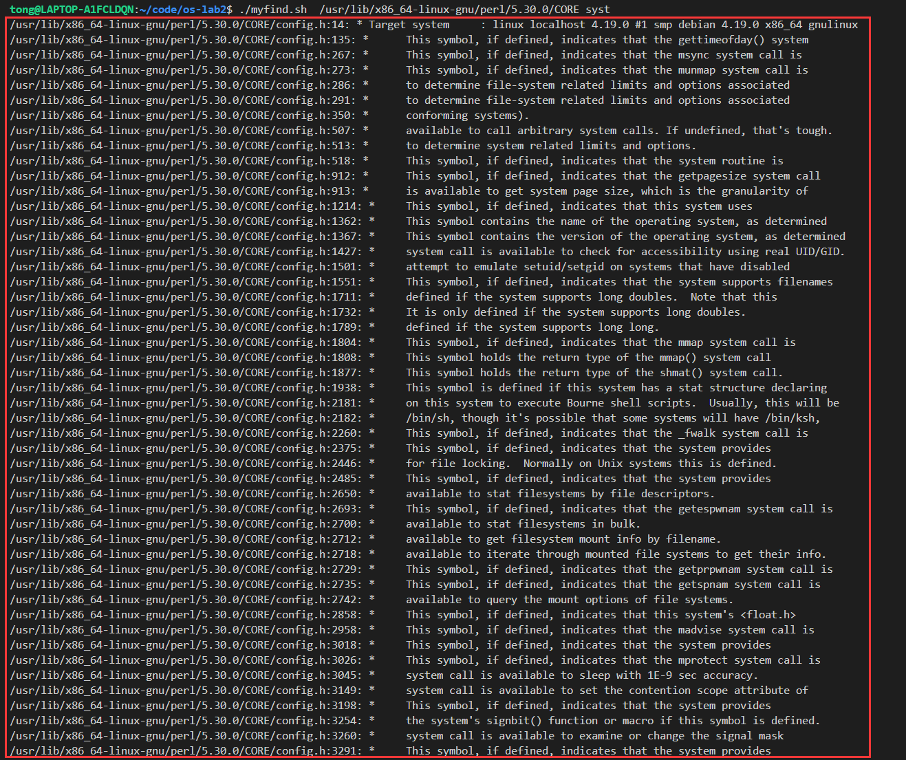
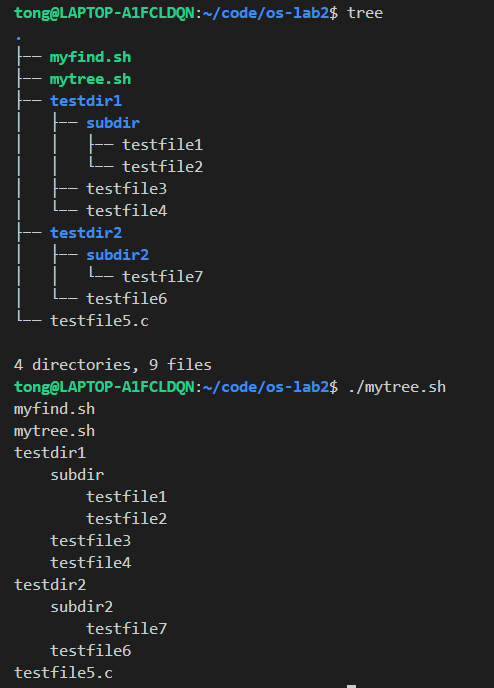

## 操作系统实验二：Shell脚本编程

### 1. 实验题目

#### 任务一`myfind`
编写一个Shell脚本，接受两个参数和，实现如下功能：

- 搜索目录树下的所有目录和文件，如果文件中的某一行中包含指定的字符串，则将该行内容和相应的文件名打印出来。
- 如果参数缺省，则在当前目录中执行上述针对的搜索和打印任务。

#### 任务二`mytree`

编写一个Shell脚本，实现如下功能：

- 按层次结构输出当前目录树中的所有目录和文件名，每层缩进个空格。

### 2. 实验目的

1. 熟悉Linux Shell脚本的编写方法
2. 熟悉相关的Linux命令

### 3. 解决思路

#### 任务一

关键点：

- 搜索目录树下的所有文件和目录，并找到符合条件的文件
- 使用指定模式匹配
- 将匹配的内容按照自定义的格式打印出来

思路：

- 使用简单的递归，遍历所有的文件和目录
- 如果文件后缀名称符合要求，对文件进行匹配
- 使用助教推荐的`grep`进行文件内容的匹配
- 如果匹配成功，打印匹配的每一行内容

源码&解释：

- 定义一个函数进行处理，并在合适的地方进行逻辑撰写，函数的传参也是按照`$x`进行传递

- `-d $1"/"$file`用来判断是否是文件夹

- `grep -q -e "$2" "$1""/""$file";`中的`-q`参数安静处理，只要匹配一个就会返回状态值，此代码中用于判断是否匹配成功

- `"${file##*.}" = "c"`判断文件后缀

- `grep -n -e $2 $1"/"$file | while read -r line`用来读取`grep`匹配的每一行

  ```shell
  #!/bin/bash
  function read_dir(){
      for file in `ls $1`       # 注意此处两个反引号，表示运行系统命令
      do
          if [ -d $1"/"$file ];  # 注意此处[]一定要加上空格，否则会报错
          then
          read_dir $1"/"$file $2
          elif [ "${file##*.}" = "c" ]||[ "${file##*.}" = "h" ];then # 判断后缀  
              grep -q -e "$2" "$1""/""$file";
              stategrep=$?;
              if [ $stategrep = 0 ];then
                  grep -n -e $2 $1"/"$file | while read -r line;
                  do       
                      echo $1"/"$file":""$line"  # 注意此处的$line一定要加上双引号
                  done
  
              fi
          fi
      done
  }   
  # 进行简单的参数数量判断
  if [ $# -eq 2 ];
  then
  read_dir $1 $2
  elif [ $# -eq 1 ];
  then
  read_dir . $1
  else
  echo 'error';
  exit;
  fi
  ```

#### 任务二

关键点：

- 遍历所有目录与文件
- 空格的打印方式

思路：

- 使用类似任务一的方案，用`-d`、`-f`进行目录与文件的判断
- 使用递归的特性进行空格的格式化输出

源码&解释：

-  定义函数`read_dir()`进行递归处理，参数一为目录，此处为shell文件所在目录；参数二为已有的空格数；

-  逻辑：如果`file`变量是文件夹，打印已有的空格与文件夹名称，并将空格数加上4个然后递归；如果是文件，打印已有的空格数与名称；

  ```shell
  #!/bin/bash
  function read_dir(){
      for file in `ls $1`       #注意此处这是两个反引号，表示运行系统命令
      do
          if [ -d $1"/"$file ];  #注意此处之间一定要加上空格，否则会报错
          then
          echo "$2"$file        #注意此处的$2一定要加上双引号，否则空格会被忽略掉
          read_dir $1"/"$file "$2""    "
          elif [ -f $1"/"$file ];
          then
          echo "$2"$file  
          fi
      done
  }   
  read_dir . ""
  ```

### 4. 测试&效果

##### 任务一

在命令行运行` ./myfind.sh  /usr/lib/x86_64-linux-gnu/perl/5.30.0/CORE syst`

输出格式为`文件绝对路径:行数:匹配的内容`，获得以下输出：



#### 任务二

为了对比，我在Ubuntu上安装了`tree`软件（一款罗列目录与文件的工具）

在命令行分别输入`tree`、`./mytree.sh`，分别获得以下输出：



这个结果说明脚本是正确的

### 5. 总结&收获

#### 报错总结

- if条件语句后面的方括号空格问题
- grep返回状态需要用`$?`表示
- 使用`while read line`时，记得，之后的`$line`需要加上双引号，否则会出现一些特殊符号被替换的错误，另外，如果想要完整保存到`line`中，需要修改`IFS`，变为`IFS= read -r line`，此方法还有其他的变形方式，不在此罗列
- 变量赋值时等于号两边不能有空格
- 空格传参的时候一定注意使用双引号，而且`$x`也是需要加上双引号，否则会默认去除空格
- **``**用来运行系统命令
- 字符串拼接问题

#### 收获

**

