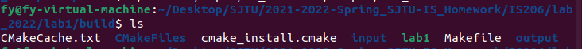

## 操作系统实验1：可变分区存储管理

[toc]

### 一、实验题目

编写一个C语言程序，模拟UNIX的可变分区内存管理，使用**循环首次适应法**实现对一块内存区域的分配和释放管理。


### 二、实验目的

1. 加深对可变分区存储管理的理解。
2. 考察使用C语言编写代码的能力，特别是C语言编程的难点之一：指针的使用。
3. 复习使用指针实现链表以及在链表上的基本操作。  


### 三、实验要求

- **一次性向系统申请一块大内存空间 (e.g. 1KB)**

  使用malloc()函数进行内存申请，作为之后管理的内存空间。

- 使用合适的数据结构：

  ```C
  struct map{
  	unsigned m_size;
  	char *m_addr;
      struct map *next, *prior;
  };
  ```

  **主要实现如下两个内存分配函数：**

```C
addr = (char *)lmalloc(unsigned size); 
lfree(unsigned size, char *addr);
```


### 四、算法思想

#### 可变分区存储

​		很容易从书本上了解到，可变分区存储管理并不预先将内存划分成分区，而是等到作业运行需要内存时就向系统申请，从空闲的内存区中申请占用空间，其大小等于作业所需内存大小。因此，可变分区存储不会产生“内零头”。每一个空闲分区使用一个map结构来进行管理，每个空闲分区按起始地址由低到高顺次登记在空闲分区存储表中。

#### 循环首次适应法

​		可变分区存储有多种管理方法：首次适应法、循环首次适应法、最佳适应法、最坏适应法，本次可变分区存储实现所采用的的算法思想就是循环首次适应法。

​		原理：把空闲表设计为顺序结构或双向链接结构的循环队列，各空闲区仍按地址从低到高的次序登记在空闲区的管理队列中。同时需设置起始查找指针，指向循环队列中的一个空闲区表项。

​		分配方式：总是从起始查找指针所指的表项开始查找。第一次找到满足要求的空闲区时，就分配所需大小的空闲区，修改表项，并调整起始查找指针，使其指向队列中被分配的后面的那块空闲区。下次分配时就从新指向的那块空闲区开始查找。

​		释放算法：释放时，如果被释放的区域不与空闲分区相邻，此时需要新增一块内存空间存储此释放区域，并将其加入空闲分区存储表中。如果被释放的区域与空闲分区相邻，则直接修改该空闲分区起始地址以及空间大小。

值得注意的是：非首次释放时，释放区与原空闲区相邻情况可归纳为四种情况（如图所示）。


### 五、算法实现

#### 数据结构&变量说明

##### 空闲块结构体

参考实验指导文件，定义一个存储空闲块的结构体，用于构成双向循环列表，包含空闲块的大小、起始地址、前向指针、后向指针。

```c
struct map{
    unsigned long m_size;
    char *m_addr;
    struct map *next, *prior;
} 
struct map Map;
```

##### 存储管理器结构体

自定义的用于管理可变分区的结构体，用于存储当前可变分区的信息，包含：目前的起始指针、整个可管理的内存空间的起始地址（不变）、剩余可分配空间、整个可管理的内存空间的大小（不变）、空闲块的数量。

```c
typedef struct map_mem_manage{
    memFree *mem_now;
    char *m_start_addr;
    unsigned long m_rest;
    unsigned long m_size;
    unsigned long m_free_count;//count of free space
} Manage;
```

##### 基本变量说明

- tmp_*：临时变量；
- mem_*：与结构体数据有关；
- m_*：结构体内部数据；
- ptr：在各个函数里都是用于替代起始指针进行操作的指针变量；
- pre：可作为临时变量；

#### 模块设计&接口说明

##### 接口定义

如下图，依次罗列：

```c
//initialize the memory
void initMemManage(Manage *mem_manager, unsigned long size, char *addr);
//allocate algorithm
void lmalloc(Manage *mem_manager, unsigned long size);
//recycle algorithm
void lfree(Manage *mem_manager, unsigned long size, char *addr);
//show free block status
void printFree(Manage *mem_manager);
//print error...
void printError(char *str);
//show current status
void printMemFree(Manage *mem_manager, Map *mem_free);
//related information
void printDeclaration();
```

##### 模块设计

- ##### **初始化模块**

  1. 申请内存空间与内存管理器结构体空间

  2. 为内存管理器结构体初始化

     ```C
     /**
      * @brief initMemManage
      * @param mem_manager
      * @param size
      * @param addr // initial address
      */
     void initMemManage(Manage *mem_manager, unsigned long size, char *addr)
     {
         Map *mem_free = (Map *)malloc(sizeof(Map));
         mem_free->m_addr = addr;
         mem_free->m_size = size;
         mem_free->next = mem_free;
         mem_free->prior = mem_free;
         mem_manager->mem_now = mem_free;
         mem_manager->m_start_addr = addr;
         mem_manager->m_rest = size;
         mem_manager->m_size = size;
         mem_manager->m_free_count = 1;
     }
     ```

- ##### **分配内存模块(lmalloc)**

  **主要思路：**

  判断所分配内存是否>剩余可分配内存，如果大于，return；

  > /*  
  >
  > ​    \*  **case1:**  The memory to be allocated is larger than the current free block
  >
  > ​    \*      But there is still enough space in total;
  >
  > ​    \*      Nothing to change
  >
  > ​    */

​		从当前内存管理器储存的起始指针开始循环，因为这是个循环链表所以要注意中断点；

​		如果待分配内存小于当前空闲块，更改该空闲块起始地址即可，同时对内存管理器中的值做一些修改；

>  /*  
>
> ​    \*  **case2**:  The memory to be allocated is smaller than the current free block
>
> ​    \*      Change the start address of the free block;
>
> ​    \*      Make some modifications to the value in the memory manager.
>
> ​    */

​		如果恰好等于当前空闲块，把当前空闲块剔除链表即可，同时对内存管理器中的值做一些修改；

> /*
>
> ​    \*  **case3:**  The memory to be allocated is exactly equal to the current free block
>
> ​    \*      Remove the current free block from the linked list;
>
> ​    \*      Make some modifications to the value in the memory manager;
>
> ​    */

​		如果找了一圈也没找着，打印error；

**代码展示：**

```C
/**
 * @brief lmalloc: allocate memory
 * @param mem_manager
 * @param size
 */
void lmalloc(Manage *mem_manager, unsigned long size)
{
    /*  
    *  case0:  Boundary conditions: no enough space (more than 1024B)
    *          Nothing to change
    */
    if (size > mem_manager->m_rest)
    {
        printError("======no more free size!!=========");
        return;
    }

    int count = 1;
    Map *ptr = mem_manager->mem_now;
    char *tmp_addr = ptr->m_addr;
    while (ptr)
    { 
        /*  
        *  case1:  The memory to be allocated is larger than the current free block
        *          But there is still enough space in total;
        *          Nothing to change
        */
        if (ptr->m_addr == tmp_addr)
        {
            if ((count--) == 0)
            {
                printError("can not find fitable field;");
                break;
            }
        }

        /*  
        *  case2:  The memory to be allocated is smaller than the current free block
        *          Change the start address of the free block;
        *          Make some modifications to the value in the memory manager.
        */
        if (size < (ptr->m_size))
        {
            ptr->m_addr += size;
            ptr->m_size -= size;
            mem_manager->m_rest -= size;
            mem_manager->mem_now = ptr;
            //printFree(mem_manager);
            break;
        }
        /*
        *  case3:  The memory to be allocated is exactly equal to the current free block
        *          Remove the current free block from the linked list;
        *          Make some modifications to the value in the memory manager;
        */
        else if (size == (ptr->m_size))
        {
            Map *tmp = ptr;
            mem_manager->mem_now = ptr->next;
            tmp->prior->next = tmp->next;
            tmp->next->prior = tmp->prior;
            free(tmp);
            mem_manager->m_rest -= size;
            mem_manager->m_free_count -= 1;
            break;
        }

        else
        {
            ptr = ptr->next;
        }
    }
}
```

- ##### **释放内存模块**

  **主要思路**：

  1. 先进行大体上的判别，比如释放地址低于起始地址等等；

  2. 判断是否还有空闲区，如果已经全部被分配，则新建一个空闲块；

  3. 如果待释放地址小于当前起始地址，那就把指针往左移动，直到当前指针刚好大于待释放起始指针或者已经到达了最左边的空闲区了；

  4. 找到这个空闲区后再次进行判断，如果待释放的区域与空闲区域进行了重叠，报错处理；

     如果与右边邻近，那就把空闲块的起始地址改一改，

     如果既与右边邻近，由于左边邻近，那就合并处理；

     做这些操作的同时，也要修改内存管理器中的一些值；

  5. 如果待释放区域大于当前起始指针，类似3进行处理；

  6. 如果等于当前起始指针，直接报错；


  		**代码展示：有点长，在此省略，可见源码**


### 六、测试方法及结果

#### 测试输入格式

由于使用了重定向输入输出，所以只需要提前把数据输入到重定向输入文件中即可。

- `m size` 其中 `m` 指分配内存，`size` 指分配内存大小；
- `f size addr` 其中 `f` 指释放内存，`size` 指释放内存大小，`addr` 为起始地址，这里是相对地址，其实最后还是转化为绝对地址做的，只不过这里方便测试；
- `e` 终止符号；

**测试输入命令：**

​			`./os-lab1 < ./input/in_5.txt > ./output/out_5.txt`

> (测试平台：ubuntu 21.10)

**文件目录结构：**



#### 各种效果

**输出解释：**

1. 每一条命令的所有输出均在两条\==\==\==\==\==\===之间；
2. 输出command命令，以及命令信息；
3. 打印在分配或者释放过程中出现的错误；
4. 打印分配或者释放之后的结果，以start print未开始，以finish print为结束；
5. 在start print开始的时候，先打印剩余内存基本信息，比如个数以及内存量等等；

**具体样例展示：**

- 要求分配内存过大

  程序输入：

  ```
  m 1001
  e
  ```

  程序输出结果：

  ```
  =============================================
  command:malloc,size:1001
  error:======no more free size!!=========
  ================the rest mem :===============
  ==============start print!!=================
  ==============number of free:1===============
  ============all size of free:1000=============
  =============================================
  addr:0
  size:1000
  =============================================
  ==============finish print!!=================
  =============================================
  
  exit
  =============================================
  ===============end program!!===============
  ===========519021910917 feiyang===========
  =============================================
  ```

- 体现循环首次适应法

  程序输入：

  先制作几个不相连的空闲块，然后分配一个内存，观察分配结果；

  ```
  m 900
  f 100 0
  f 100 150
  f 200 300
  m 150
  e
  ```

  程序输出：

  ```
  =============================================
  command:malloc,size:900
  ================the rest mem :===============
  ==============start print!!=================
  ==============number of free:1===============
  ============all size of free:100=============
  =============================================
  addr:900
  size:100
  =============================================
  ==============finish print!!=================
  =============================================
  
  =============================================
  command:lfree,addr:94500194538192,size:100
  ================the rest mem :===============
  ==============start print!!=================
  ==============number of free:2===============
  ============all size of free:200=============
  =============================================
  addr:900
  size:100
  =============================================
  =============================================
  addr:0
  size:100
  =============================================
  ==============finish print!!=================
  =============================================
  
  =============================================
  command:lfree,addr:94500194538342,size:100
  ================the rest mem :===============
  ==============start print!!=================
  ==============number of free:3===============
  ============all size of free:300=============
  =============================================
  addr:900
  size:100
  =============================================
  =============================================
  addr:0
  size:100
  =============================================
  =============================================
  addr:150
  size:100
  =============================================
  ==============finish print!!=================
  =============================================
  
  =============================================
  command:lfree,addr:94500194538492,size:200
  ================the rest mem :===============
  ==============start print!!=================
  ==============number of free:4===============
  ============all size of free:500=============
  =============================================
  addr:900
  size:100
  =============================================
  =============================================
  addr:0
  size:100
  =============================================
  =============================================
  addr:150
  size:100
  =============================================
  =============================================
  addr:300
  size:200
  =============================================
  ==============finish print!!=================
  =============================================
  
  =============================================
  command:malloc,size:150
  ================the rest mem :===============
  ==============start print!!=================
  ==============number of free:4===============
  ============all size of free:350=============
  =============================================
  addr:450
  size:50
  =============================================
  =============================================
  addr:900
  size:100
  =============================================
  =============================================
  addr:0
  size:100
  =============================================
  =============================================
  addr:150
  size:100
  =============================================
  ==============finish print!!=================
  =============================================
  
  exit
  =============================================
  ===============end program!!===============
  ===========519021910917 feiyang===========
  =============================================
  ```

- 释放已经存满的情况

  程序输入

  ```
  m 1000
  f 100 1
  e
  ```

  程序输出：

  可以看到其情况符合预期：

  ```
  =============================================
  command:malloc,size:1000
  ================the rest mem :===============
  ===============start print!!================
  ==============no free print!!================
  ==============finish print!!=================
  =============================================
  
  =============================================
  command:lfree,addr:93944027443921,size:100
  ================the rest mem :===============
  ==============start print!!=================
  ==============number of free:1===============
  ============all size of free:100=============
  =============================================
  addr:1
  size:100
  =============================================
  ==============finish print!!=================
  =============================================
  
  exit
  =============================================
  ===============end program!!===============
  ===========519021910917 feiyang===========
  =============================================
  ```

另外还有情况如：

- 释放内存与右边临近；
- 释放内存与左边临近；
- 释放内存错误；

还制作了一个比较长的样例，放在了/build/input目录下in_4.txt；相应的输出在/build/output下


### 七、错误分析

在这里列举一些会引发报错的情况：

- 分配内存空间不够：error: =\==\==\=no more free size!!=\====\=\==\=";
- 找了一圈没找到合适的：error: can not find fitable field;
- 释放内存，与空闲区重叠：error: addr overlay；
- 释放内存过大等等；

​		经过**大量的测试**，程序在处理内存分配以及合并的过程中能够有效地处理一样情况，不会造成程序的崩溃或者代码运行结果的错误。

​		大部分可能预知的错误处理已经写在程序的出错处理中，但还有少数可能未考虑。例如对于用户输入，没有对特别奇怪的用户输入进行限制，如果用户输入**大量随意的字符串**，可能造成程序的崩溃（ubuntu也崩溃了...)，因此，有必要将用户输入处理的接口封装调用，增强代码的鲁棒性。


### 八、实验总结

​		本次实验中我动手实践了**内存分区管理**技术，使用的方法是**循环首次适应法**，实现了对一块内存区域的分配和释放管理。在实验过程中，我加深对可变分区存储管理的理解，使用了双向指针完成循环列表指针的使用，巩固了指针在链表上的基本操作。此外，我还学到了重定向输入输出等一些实用的小技巧。 

​		在程序中的关键点主要是lfree函数，其中需要考虑首次释放和非首次释放，这里我使用了大量的逻辑判断语句来实现这一功能，另外实验需要考虑不同程度的报错处理。

​		为了让代码能够尽可能**高效快速**的运行，需要用到很多指针的知识。但指针一直是C语言的一个难点之一，因此对于指针的操作需要非常谨慎，考虑到各种可能的情况，比如为`nullptr`、仅有一个节点和有两个节点的情况，比如插入在连续内存块头部和尾部的情况，比如**新增节点后的指针变动**等。这些不但提升了我的代码编程能力，尤其是对于C语言的理解，而且锻炼了我的思考能力和对问题全面分析的能力，仔细地审查自己的代码逻辑是否具有漏洞，是否考虑到了各种情况，这对于身为**网络安全**专业的我来说也是非常重要的。

​		最后，本次实验对我理解内存分区管理的各种技术有**巨大的帮助**，只有在亲自动手实践的情况下我才能发现自己对哪些概念的理解有问题，哪些还不够深刻，这对于我课内知识的学习也有很大的帮助。感谢老师在**课堂**讲授的知识帮助我顺利完成了本次实验。


### 九、附录

manage_memory.c源码：[IS206_OS_lab/memory_manage.c at master · 2020dfff/IS206_OS_lab (github.com)](https://github.com/2020dfff/IS206_OS_lab/blob/master/lab1/memory_manage.c)

测试输入附录：[IS206_OS_lab/lab1/build/input at master · 2020dfff/IS206_OS_lab (github.com)](https://github.com/2020dfff/IS206_OS_lab/tree/master/lab1/build/input)


***

> Author：费扬
>
> Github：[2020dfff/IS206_OS_lab: Repo for SJTU_IS206 Operating System Course Design. (github.com)](https://github.com/2020dfff/IS206_OS_lab)
>
> Date：2022-04-01

***

