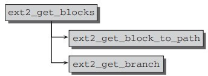
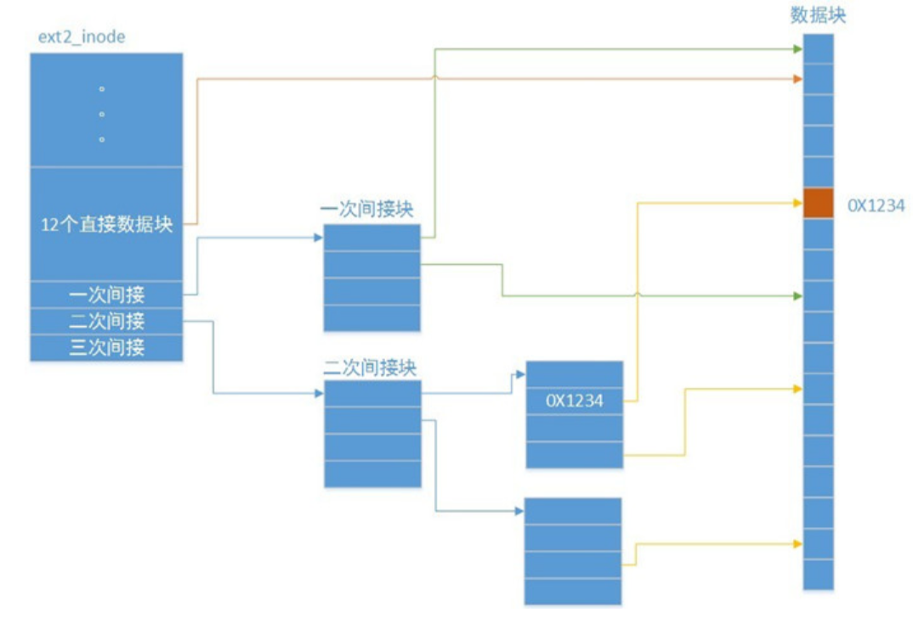

## 操作系统实验3： OpenEuler文件系统代码分析

> 费扬 519021910917 
>
> 2022.05.24
>
> 2022春 操作系统 lab-3

[TOC]

## 一、实验题目

1. 通过阅读源码了解UNIX文件系统文件索引结构，以EXT2第二代扩展文件系统为例。
2. 代码位置在/kernelopenEuler-1.0-LTS/fs/ext2，核心功能由inode.c实现。
3. 官方文档内容在kernel/Documentation/filesystems下。
4. 本次作业提示中内容并不完整，同学们同时需要在阅读中探索源码其他需要解读的部分。


## 二、背景知识

### openEuler

​		openEuler是一款开源操作系统。当前openEuler内核源于Linux，支持鲲鹏及其它多种处理器，能够充分释放计算芯片的潜能，是由全球开源贡献者构建的高效、稳定、安全的开源操作系统，适用于数据库、大数据、云计算、人工智能等应用场景。同时，openEuler是一个面向全球的操作系统开源社区，通过社区合作，打造创新平台，构建支持多处理器架构、统一和开放的操作系统，推动软硬件应用生态繁荣发展。

​		本次发行版本为 openEuler 1.0 的 Base 版本，即基础版本，包含了运行最小系统的核心组件。

​		而openEuler kernel是openEuler操作系统的核心，是系统性能和稳定性的基础，是处理器、设备和服务之间的桥梁。


### 文件系统

​		在操作系统中，文件系统是用于为用户和应用程序管理文件的系统软件集合。

​		如：FAT，FAT32，NTFS，EXT2等，本次在openEuler下的文件系统即为EXT2。

​		此外，众所周知，文件系统是Unix系统最基本的资源。最初的Unix系统一般都只支持一种单一类型的文件系 统，在这种情况下，文件系统的结构深入到整个系统内核中。而现在的系统大多都在系统内核和文件系统之间提供一个标准的接口，这样不同文件结构之间的数据可以十分方便地交换。

​		Linux也在系统内核和文件系统之间提供了一种叫做VFS（virtual file system）的标准接口。


### openEuler目录架构

|  目录/文件名   |                         源码功能简介                         |
| :------------: | :----------------------------------------------------------: |
| /Documentation |            说明文档，对每个目录的具体作用进行说明            |
|     /arch      | 不同CPU架构下的核心代码。其中的每一个子目录都代表Linux支持的CPU架构 |
|     /block     |                        块设备通用函数                        |
|     /certs     |                          与证书相关                          |
|    /crypto     |    常见的加密算法的C语言实现代码，譬如crc32、md5、sha1等     |
|    /drivers    | 内核中所有设备的驱动程序，其中的每一个子目录对应一种设备驱动 |
|    /include    |                     内核编译通用的头文件                     |
|     /init      |                     内核初始化的核心代码                     |
|      /ipc      |                    内核中进程间的通信代码                    |
|    /kernel     | 内核的核心代码，此目录下实现了大多数Linux系统的内核函数。与处理器架构相关的内核代码在/kernel/$ARCH/kernel |
|      /lib      |  内核共用的函数库，与处理器架构相关的库在/kernel/$ARCH/lib   |
|      /mm       | 内存管理代码，譬如页式存储管理内存的分配和释放等。与具体处理器架构相关的内存管理代码位于/arch/$ARCH/mm目录下 |
|      /net      |                       网络通信相关代码                       |
|    /samples    |                           示例代码                           |
|    /scripts    |      用于内核配置的脚本文件，用于实现内核配置的图形界面      |
|   /security    |                       安全性相关的代码                       |
|     /sound     |          与音频有关的代码，包括与音频有关的驱动程序          |
|     /tools     |                      Linux中的常用工具                       |
|      /usr      | 该目录中的代码为内核尚未完全启动时执行用户空间代码提供了支持 |
|     /virt      |   此文件夹包含了虚拟化代码，它允许用户一次运行多个操作系统   |
|    COPYING     |                        许可和授权信息                        |
|    CREDITS     |                          贡献者列表                          |
|     Kbuild     |           内核设定脚本，可以对内核中的变量进行设定           |
|    Kconfig     |              配置哪些文件编译，那些文件不用编译              |
|    Makefile    |    该文件将编译参数、编译所需的文件和必要的信息传给编译器    |


### 一般函数

​		这些函数的路径在/kernel/fs下，通过使用VFS，文件系统的代码就分成了两部分：上层用于处理系统内核的各种表格和数据结构；而下层用来实现文件系统本身的函数，并通过VFS来调用。这些函数一般包括：

| 函数作用                                    |      函数名       |
| ------------------------------------------- | :---------------: |
| 管理缓冲区                                  |     buffer. c     |
| 响应系统调用fcntl()和ioctl()                | fcntl.c & ioctl.c |
| 将管道和文件输入/输出映射到索引节点和缓冲区 |  fifo.c, pipe.c   |
| 锁定和不锁定文件和记录                      |      locks.c      |
| 映射名字到索引节点                          |  namei.c, open.c  |
| 实现select( )函数                           |     select.c      |
| 提供各种信息                                |      stat.c       |
| 挂接和卸载文件系统                          |      super.c      |
| 调用可执行代码和转存核心                    |      exec.c       |
| 装入各种二进制格式                          |    bin_fmt*.c     |


## 三、代码分析

### 核心内容

​		本次lab的基本核心代码是openEuler-1.0-LTS/fs/ext2/inode.c，主要阅读了解其文件系统的核心功能如何调用实现。

#### inode 概述

##### 区别inode和block

​		文件是存储在硬盘上的，硬盘的最小存储单位叫做扇区`sector`，每个扇区存储`512字节`。操作系统读取硬盘的时候，不会一个个扇区地读取，这样效率太低，而是一次性连续读取多个扇区，即一次性读取一个块`block`。这种由多个扇区组成的块，是文件存取的最小单位。块的大小，最常见的是`4KB`，即连续八个`sector`组成一个`block`。

​		文件数据存储在块中，那么还必须找到一个地方存储文件的元信息，比如文件的创建者、文件的创建日期、文件的大小等等。这种存储文件元信息的区域就叫做`inode`，中文译名为`索引节点`，也叫`i节点`。因此，一个文件必须占用一个`inode`，但至少占用一个`block`。

- 元信息 → inode
- 数据 → block

##### inode 内容

​		`inode`包含很多的文件元信息，但不包含文件名，例如：字节数、属主`UserID`、属组`GroupID`、读写执行权限、时间戳等。而文件名存放在目录当中，但`Linux`系统内部不使用文件名，而是使用`inode号码`识别文件。对于系统来说文件名只是`inode号码`便于识别的别称。

​		可以使用如下指令在linux系统下查看某一文件的 `inode`信息：

```bash
[root@localhost ~]$ stat test.txt
 File: ‘test.txt’
  Size: 18              Blocks: 8          IO Block: 4096   regular file
Device: fd00h/64768d    Inode: 33574994    Links: 1
Access: (0644/-rw-r--r--)  Uid: (    0/    root)   Gid: (    0/    root)
Context: unconfined_u:object_r:admin_home_t:s0
Access: 2019-08-28 19:55:05.920240744 +0800
Modify: 2019-08-28 19:55:05.920240744 +0800
Change: 2019-08-28 19:55:05.920240744 +0800
 Birth: -
```

​		或是使用查看文件`i节点号`的方法，查看node编号：

```bash
[root@localhost ~]$ ls -i
33574991 anaconda-ks.cfg      2086 test  33574994 test.txt
```


#### ext2_get_block

​		要从硬盘上读文件，首先要找到文件数据所在的数据块， ext2_get_block实现的就是这个关键的功能。ext2_get_block的函数声明是：

```C
static int ext2_get_blocks(struct inode *inode,
			   sector_t iblock, unsigned long maxblocks,
			   u32 *bno, bool *new, bool *boundary,
			   int create)
```

​		该函数是对**ext2_get_blocks**的封装，其中的**iblock**是**inode**中的第几块。

​		所有希望使用VFS的标准函数的文件系统都必须定义一个类型为**get_block_t**的函数，其原型如下：

```C
typedef int(get_block_t)(struct inode *inode, sector_t iblock,

struct buffer_head *bh_result, int create);
```

​		接下来我们来看这个函数怎么寻找到数据块的。

​		首先要说明的是ext2_get_block不仅读取块，还有可能从内存向块设备的数据块写入数据，后者的情况就要创建新块了，而参数中的create就是控制是否创建新块的。

​		我们先看简单的情况，即只进行读取的情况，这时**ext2_get_blocks**的代码流程如下图所示：



​		有了这些背景知识，我们就可以深入到 ext2_get_block()的代码中了。这里用到的一些宏定义都在**include/linux/ext2_fs.h** 中:		

```C
#define EXT2_NAME_LEN 255
/*
 * Maximal count of links to a file
 */
#define EXT2_LINK_MAX		32000
#define EXT2_SB_MAGIC_OFFSET	0x38
#define EXT2_SB_BLOCKS_OFFSET	0x04
#define EXT2_SB_BSIZE_OFFSET	0x18
```

在`i_blcok`字段中存放了文件的块的地址，数组大小为**EXT2_N_BLOCKS**；

​		参数` iblock`表示所处理的记录块在文件中的逻辑块号；

​		`inode`则指向文件的`inode`结构;

​		参数 `create`表示是否需要创建；

​		从 **block_prepare_write()**中传下的实际参数值为1，所以我们在这里只关心 create为1的情景。从文件内块号到设备上块号的映射,最简单最迅速的当然莫过于使用一个以文件内块号为下标的线性数组,并且将这个数组置于索引节点 inode结构中。可是,那样就需要很大的数组,从而使索引节点和 inode结构也变得很大,或者就得使用可变长度的索引节点而使文件系统的结构更加复杂。

​		另一种方法是采用间接寻址，也就是将上述的数组分块放在设备上本来可用于存储数据的若干记录块中，而将这些记录块的块号放在索引节点和 inode结构中。这些记录块虽然在设备上的数据区（而不是索引节点区）中，却并不构成文件本身的内容，而只是一些管理信息。由于索引节点（和 inode结构）应该是固定大小的，所以当文件较大时还要将这种间接寻址的结构框架做成树状或链状，这样才能随着文件本身的大小而扩展其容量，显然，这种方法解决了容量的问题，但是降低了运行时的效率。

​		linux中使用了一种间接的解决办法来处理大文件，将大文件的数据块的指针间接存储如下图：



​		基于这些考虑，从Unix 早期就采用了一种折衷的方法，可以说是直接与间接相结合。其方法是把整个文件的记录块寻址分成几个部分来实现。第一部分是个以文件内块号为下标的数组，这是采用直接映射的部分，对于较小的文件这一部分就够用了。由于根据文件内块号就可以在 inode结构里的数组中直接找到相应的设备上块号，所以效率很高。至于比较大的文件，其开头那一部分记录块号也同样直接就可以找到，但是当文件的大小超出这一部分的容量时，超出的那一部分就要采用间接寻址了。

​		Ext2文件系统的这一部分的大小为12个记录块，即数组的大小为12。当记录块大小为1K字节时，相应的文件大小为12K字节。在 Ext2文件系统的 ext2_inode_info结构中，有个大小为15的整型数组i_data[]，其开头12个元素即用于此项目。当文件大小超过这一部分的容量时，该数组中的第13个元素指向一个记录块，这个记录块的内容也是一个整型数组，其中的每个元素都指向一个设备上记录块。

​		如果记录块大小为1K字节,则该数组的大小为256,也就是说间接寻址的容量为256个记录块,即256K字节。这样，两个部分的总容量为12K + 256K = 268K字节。可是，更大的文件还是容纳不下，所以超过此容量的部分要进一步采用双重(二层)间接寻址。此时 inode结构里 i_data[]数组中的第14个元素指向另一个记录块，该记录块的内容也是一个数组，但是每个元素都指向另一个记录块中的数组，那才是文件内块号至设备上块号的映射表。这么一来，双重间接寻址部分的能力为256×256=64K个记录块，即64M字节。依此类推，数组 i_data[]中的第15个元素用于三重(三层）间接寻址，这一部分的容量可达256 ×256 ×256= 16M个记录块，也就是16G字节，所以，对于32位结构的系统，当记录块大小为1K字节时,文件的最大容量为16G+64M+ 256K＋12K。如果设备的容量大于这个数值，就得采用更大的记录块大小了。


#### ext2_block_to_path和ext2_get_branch

​		在ext2_get_block的如下代码中，ext2_block_to_path找到通向块的路径，ext2_get_branch循着这个路径到达一个数据块:

```C
	int err;
	int offsets[4];
	Indirect chain[4];
	Indirect *partial;
	ext2_fsblk_t goal;
	int indirect_blks;
	int blocks_to_boundary = 0;
	int depth;
	struct ext2_inode_info *ei = EXT2_I(inode);
	int count = 0;
	ext2_fsblk_t first_block = 0;

	BUG_ON(maxblocks == 0);

	depth = ext2_block_to_path(inode,iblock,offsets,&blocks_to_boundary);

	if (depth == 0)
		return -EIO;

	partial = ext2_get_branch(inode, depth, offsets, chain, &err);
	/* Simplest case - block found, no allocation needed */
	if (!partial) {
		first_block = le32_to_cpu(chain[depth - 1].key);
		count++;
		/*map more blocks*/
		while (count < maxblocks && count <= blocks_to_boundary) {
			ext2_fsblk_t blk;

			if (!verify_chain(chain, chain + depth - 1)) {
				/*
				 * Indirect block might be removed by truncate when we read it.
				 * Handling of that case: forget what we've got now, go to reread.
				 */
				err = -EAGAIN;
				count = 0;
				partial = chain + depth - 1;
				break;
			}
			blk = le32_to_cpu(*(chain[depth-1].p + count));
			if (blk == first_block + count)
				count++;
			else
				break;
		}
		if (err != -EAGAIN)
			goto got_it;
	}
```

​		首先根据文件内块号计算出这个记录块落在哪一个区间，要采用几重映射(1表示直接)。这是由ext2_block_to_path()完成的，其代码在 fs/ext2/inode.c 中:

```C
static int ext2_block_to_path(struct inode *inode,
			long i_block, int offsets[4], int *boundary)
{
	int ptrs = EXT2_ADDR_PER_BLOCK(inode->i_sb);
	int ptrs_bits = EXT2_ADDR_PER_BLOCK_BITS(inode->i_sb);
	const long direct_blocks = EXT2_NDIR_BLOCKS,
		indirect_blocks = ptrs,
		double_blocks = (1 << (ptrs_bits * 2));
	int n = 0;
	int final = 0;

	if (i_block < 0) {
		ext2_msg(inode->i_sb, KERN_WARNING,
			"warning: %s: block < 0", __func__);
	} else if (i_block < direct_blocks) {
		offsets[n++] = i_block;
		final = direct_blocks;
	} else if ( (i_block -= direct_blocks) < indirect_blocks) {
		offsets[n++] = EXT2_IND_BLOCK;
		offsets[n++] = i_block;
		final = ptrs;
	} else if ((i_block -= indirect_blocks) < double_blocks) {
		offsets[n++] = EXT2_DIND_BLOCK;
		offsets[n++] = i_block >> ptrs_bits;
		offsets[n++] = i_block & (ptrs - 1);
		final = ptrs;
	} else if (((i_block -= double_blocks) >> (ptrs_bits * 2)) < ptrs) {
		offsets[n++] = EXT2_TIND_BLOCK;
		offsets[n++] = i_block >> (ptrs_bits * 2);
		offsets[n++] = (i_block >> ptrs_bits) & (ptrs - 1);
		offsets[n++] = i_block & (ptrs - 1);
		final = ptrs;
	} else {
		ext2_msg(inode->i_sb, KERN_WARNING,
			"warning: %s: block is too big", __func__);
	}
	if (boundary)
		*boundary = final - 1 - (i_block & (ptrs - 1));

	return n;
}
```

​		根据上面这些宏定义，在记录块大小为1K字节时，代码中的局部量ptrs赋值为256，从而**indirect_blocks**也是256。与 ptrs相对应的**ptrs_bits**则为8，因为256是由1左移8位而成的。同样地，二次间接的容量double_blocks就是由1左移16位，即64K。而三次间接的容量为由1左移24位，即16M。
​		除映射“深度”外，还要算出在每一层映射中使用的位移量，即数组中的下标，并将计算的结果放在一个数组 offset[]中备用。例如，文件内块号10不需要间接映射，一步就能到位，所以返回值为1，并于offset[0]中返回在第一个数组，即i_data[]中的位移10。可是，假若文件内块号为20，则返回值为2，而 offset[0]为12，offset[1]为8。这样，就在数组offset[]中为各层映射提供了一条路线。数组的大小是4，因为最多就是三重间接。参数 offset 实际上是一个指针，在C语言里数组名与指针是等价的。
​		如果**ext2_block_to_path()**的返回值为0表示出了错，因为文件内块号与设备上块号之间至少也得映射一次。出错的原因可能是文件内块号太大或为负值，或是下面要讲到的冲突。否则，就进一步从磁盘上逐层读入用于间接映射的记录块，这是由**ext2_get_branch()**完成的。

```C
static Indirect *ext2_get_branch(struct inode *inode,
				 int depth,
				 int *offsets,
				 Indirect chain[4],
				 int *err)
{
	struct super_block *sb = inode->i_sb;
	Indirect *p = chain;
	struct buffer_head *bh;

	*err = 0;
	/* i_data is not going away, no lock needed */
	add_chain (chain, NULL, EXT2_I(inode)->i_data + *offsets);
	if (!p->key)
		goto no_block;
	while (--depth) {
		bh = sb_bread(sb, le32_to_cpu(p->key));
		if (!bh)
			goto failure;
		read_lock(&EXT2_I(inode)->i_meta_lock);
		if (!verify_chain(chain, p))
			goto changed;
		add_chain(++p, bh, (__le32*)bh->b_data + *++offsets);
		read_unlock(&EXT2_I(inode)->i_meta_lock);
		if (!p->key)
			goto no_block;
	}
	return NULL;

changed:
	read_unlock(&EXT2_I(inode)->i_meta_lock);
	brelse(bh);
	*err = -EAGAIN;
	goto no_block;
failure:
	*err = -EIO;
no_block:
	return p;
}
```

​		与前一个函数中的**offset[]**一样，这里的参数 **chain[]**也是一个指针，指向一个Indirect结构数组，其类型定义于fs/ext2/inode.c:

```C
typedef struct {
	__le32	*p;
	__le32	key;
	struct buffer_head *bh;
} Indirect;
```

​		根据数组**offset[]**（参数 offsets 指向这个数组）的指引，这个函数逐层将用于记录块号映射的记录块读入内存，并将指向缓冲区的指针保存在数组chain[]的相应元素，即 Indirect结构中。同时，还要使该Indirect结构中的指针p指向本层记录块号映射表（数组)中的相应表项，并使字段key 持有该表项的内容。具体Indirect结构的内容是由**add_chain()**设置的:

```C
static inline void add_chain(Indirect *p, struct buffer_head *bh, __le32 *v)
{
	p->key = *(p->p = v);
	p->bh = bh;
}
```

​		在**ext2_get_branch()**的代码中可以看到:从设备上逐层读入用于间接映射的记录块时,每通过**bread()**读入一个记录块以后都要调用**verify_chain()**再检查一下映射链的有效性，实质上是检查各层映射表中有关的内容是否改变了(见代码中的条件from->key==*from->p)。

​		从设备上读入一个记录块是费时间的操作，当前进程会进入睡眠而系统会调度其它进程运行，就有可能发生冲突。例如，被调度运行的进程可能会打开这个文件并加以截尾，即把文件原有的内容删除。所以，当因等待读入中间记录块而进入睡眠的进程恢复运行的时候，可能会发现原来有效的映射链已经变成无效了，此时 **ext2_get_branch()**返回一个出错代码-EAGAIN。当然，发生这种情况的概率是很小的，但是一个软件是否“健壮”就在于是否考虑到了所有的可能。

​		这样，**ext2_get_branch()**深化了**ext2_block_to_path()**所取得的结果，二者合在一起基本完成了从文件内块号到设备上块号的映射。

​		从ext2_get_branch()返回的值有两种可能。首先，如果顺利完成了映射则返回值为**NULL**。其次，如果在某一层上发现映射表内的相应表项为0，则说明这个表项(记录块）原来并不存在，现在因为写操作而需要扩充文件的大小。此时返回**指向该层Indirect结构的指针**，表示映射在此“断裂”了。此外，如果映射的过程中出了错，例如读记录块失败，则通过参数err返回一个出错代码。

​		回到ext2_get_block()的代码中。如果顺利完成了映射，就把所得的结果填入作为参数传下来的缓冲区结构bh_result 中，然后把映射过程中读入的缓冲区（用于间接映射）全都释放，就最后完成了记录块号的映射。
可是，要是 ext2_get_branch()返回了一个非0指针（代码中的局部量partial)，那就说明映射在某一层上断裂了。根据映射的深度和断裂的位置（层次)，这个记录块也许还只是个中间的、用于间接映射的记录块，也许就是最终的目标记录块。总之，在这种情况下，要在设备上为目标记录块以及可能需要的中间记录块分配空间。

​		

#### ext2_find_goal和ext2_find_near()

​		首先从本文件的角度为目标记录块的分配提出一个“建议块号”，由 **ext2_find_goal()**确定(fs/ext2/inode.c):

```C
static inline ext2_fsblk_t ext2_find_goal(struct inode *inode, long block,
					  Indirect *partial)
{
	struct ext2_block_alloc_info *block_i;

	block_i = EXT2_I(inode)->i_block_alloc_info;

	/*
	 * try the heuristic for sequential allocation,
	 * failing that at least try to get decent locality.
	 */
	if (block_i && (block == block_i->last_alloc_logical_block + 1)
		&& (block_i->last_alloc_physical_block != 0)) {
		return block_i->last_alloc_physical_block + 1;
	}

	return ext2_find_near(inode, partial);
}
```

​		可是，文件内逻辑块号也有可能不连续，也就是说对文件的扩充是跳跃的，新的逻辑块号与文件原有的最后一个逻辑块号之间留一下了“空洞”。这种情况发生在通过系统调用lseek()将已打开文件的当前读写位置推进到了超出文件末尾之后，可以在文件中造成这样的空洞是lseek()的一个重要性质。在这种情况下怎样确定对设备上记录块号的建议值呢?这就是调用**ext2_find_near()**的目的。

```C
static ext2_fsblk_t ext2_find_near(struct inode *inode, Indirect *ind)
{
	struct ext2_inode_info *ei = EXT2_I(inode);
	__le32 *start = ind->bh ? (__le32 *) ind->bh->b_data : ei->i_data;
	__le32 *p;
	ext2_fsblk_t bg_start;
	ext2_fsblk_t colour;

	/* Try to find previous block */
	for (p = ind->p - 1; p >= start; p--)
		if (*p)
			return le32_to_cpu(*p);

	/* No such thing, so let's try location of indirect block */
	if (ind->bh)
		return ind->bh->b_blocknr;

	/*
	 * It is going to be referred from inode itself? OK, just put it into
	 * the same cylinder group then.
	 */
	bg_start = ext2_group_first_block_no(inode->i_sb, ei->i_block_group);
	colour = (current->pid % 16) *
			(EXT2_BLOCKS_PER_GROUP(inode->i_sb) / 16);
	return bg_start + colour;
}
```

​		首先将起点 start 设置成指向当前映射表（映射过程中首次发现映射断裂的那个映射表）的起点，然后在当前映射表内往回搜索。如果要分配的是空洞后面的第一个记录块，那就要往回找到空洞之前的表项所对应的物理块号，并以此为建议块号。当然，这个物理块已经在使用中，这个要求是不可能满足的。但是，内核在分配物理记录块时会在位图中从这里开始往前搜索，就近分配空闲的物理记录块。

​		还有一种可能，就是空洞在一个间接映射表的开头处，所以往回搜索时在本映射表中找不到空洞之前的表项，此时就以间接映射表本身所在的记录块作为建议块号。同样，内核在分配物理块号时也会从此开始向前搜索。最后还有一种可能，空洞就在文件的开头处，那就以索引节点所在块组的第一个数据记录块作为建议块号。

​		

#### ext2_alloc_branch()和ext2_alloc_blocks()

​		回到ext2_get_block()的代码中。设备上具体记录块的分配，包括目标记录块和可能需要的用于间接映射的中间记录块，以及映射的建立，是由 **ext2_alloc_branch()**完成的。调用之前先要算出映射断裂点离终点的距离，也就是还有几层映射需要建立。有关的代码都在fs/ext2/inode.c中。

```C
static int ext2_alloc_branch(struct inode *inode,
			int indirect_blks, int *blks, ext2_fsblk_t goal,
			int *offsets, Indirect *branch)
{
	int blocksize = inode->i_sb->s_blocksize;
	int i, n = 0;
	int err = 0;
	struct buffer_head *bh;
	int num;
	ext2_fsblk_t new_blocks[4];
	ext2_fsblk_t current_block;

	num = ext2_alloc_blocks(inode, goal, indirect_blks,
				*blks, new_blocks, &err);
	if (err)
		return err;

	branch[0].key = cpu_to_le32(new_blocks[0]);
	/*
	 * metadata blocks and data blocks are allocated.
	 */
	for (n = 1; n <= indirect_blks;  n++) {
		/*
		 * Get buffer_head for parent block, zero it out
		 * and set the pointer to new one, then send
		 * parent to disk.
		 */
		bh = sb_getblk(inode->i_sb, new_blocks[n-1]);
		if (unlikely(!bh)) {
			err = -ENOMEM;
			goto failed;
		}
		branch[n].bh = bh;
		lock_buffer(bh);
		memset(bh->b_data, 0, blocksize);
		branch[n].p = (__le32 *) bh->b_data + offsets[n];
		branch[n].key = cpu_to_le32(new_blocks[n]);
		*branch[n].p = branch[n].key;
		if ( n == indirect_blks) {
			current_block = new_blocks[n];
			/*
			 * End of chain, update the last new metablock of
			 * the chain to point to the new allocated
			 * data blocks numbers
			 */
			for (i=1; i < num; i++)
				*(branch[n].p + i) = cpu_to_le32(++current_block);
		}
		set_buffer_uptodate(bh);
		unlock_buffer(bh);
		mark_buffer_dirty_inode(bh, inode);
		/* We used to sync bh here if IS_SYNC(inode).
		 * But we now rely upon generic_write_sync()
		 * and b_inode_buffers.  But not for directories.
		 */
		if (S_ISDIR(inode->i_mode) && IS_DIRSYNC(inode))
			sync_dirty_buffer(bh);
	}
	*blks = num;
	return err;

failed:
	for (i = 1; i < n; i++)
		bforget(branch[i].bh);
	for (i = 0; i < indirect_blks; i++)
		ext2_free_blocks(inode, new_blocks[i], 1);
	ext2_free_blocks(inode, new_blocks[i], num);
	return err;
}
```

​		参数 **num**表示还有几层映射需要建立，实际上也就是一共需要分配几个记录块，指针 branch指向前面的数组chain[]中从映射断裂处开始的那一部分，offset则指向数组offsets[]中的相应部分。例如，假若具体的映射是三重间接映射,而在第二层间接映射表中发现相应表项为0，那么branch指向chain[2]，而offset 指向 offsets[2]，num则为2，此时需要分配的是用于第三层间接映射表的记录块以及目标记录块。

​		从某种意义上，分配记录块和建立映射的过程可以看作是对这两个数组的“修复”，是在完成**ext2_get_branch()**和 **ext2_block_to_path()**未完成的工作。代码中的 branch[0]表示断裂点的 Indirect结构，是顺着映射的路线“自顶向下”逐层地通过 **ext2_alloc_blocks()**在设备上分配记录块和建立映射。

​		除最底层的记录块，即目标记录块以外，其它的记录块(见代码中的for循环)都要通过get_block()为其在内存中分配缓冲区，并通过memset()将其缓冲区清成全0，然后在该缓冲区中建立起本层的映射，再把它标志成“脏”。如果要求同步操作的话，还要立即调用**ll_rw_block()**把它写回到设备上。注意代码中的 for 循环里面为之分配缓冲区的是parent，这都是用于间接映射的记录块，而不是位于最底层的目标记录块。

​		函数**ext2_alloc_blocks()**的代码也在fs/ext2/inode.c 中:

```C
static int ext2_alloc_blocks(struct inode *inode,
			ext2_fsblk_t goal, int indirect_blks, int blks,
			ext2_fsblk_t new_blocks[4], int *err)
{
	int target, i;
	unsigned long count = 0;
	int index = 0;
	ext2_fsblk_t current_block = 0;
	int ret = 0;

	/*
	 * Here we try to allocate the requested multiple blocks at once,
	 * on a best-effort basis.
	 * To build a branch, we should allocate blocks for
	 * the indirect blocks(if not allocated yet), and at least
	 * the first direct block of this branch.  That's the
	 * minimum number of blocks need to allocate(required)
	 */
	target = blks + indirect_blks;

	while (1) {
		count = target;
		/* allocating blocks for indirect blocks and direct blocks */
		current_block = ext2_new_blocks(inode,goal,&count,err);
		if (*err)
			goto failed_out;

		target -= count;
		/* allocate blocks for indirect blocks */
		while (index < indirect_blks && count) {
			new_blocks[index++] = current_block++;
			count--;
		}

		if (count > 0)
			break;
	}

	/* save the new block number for the first direct block */
	new_blocks[index] = current_block;

	/* total number of blocks allocated for direct blocks */
	ret = count;
	*err = 0;
	return ret;
failed_out:
	for (i = 0; i <index; i++)
		ext2_free_blocks(inode, new_blocks[i], 1);
	if (index)
		mark_inode_dirty(inode);
	return ret;
}
```

​		我们首先看看该函数的参数：

1. inode：代表了需要分配磁盘块的文件；
2. goal：上层调用者给出的建议分配磁盘块号；
3. indirect_blks：需要分配的间接块的数目；
4. new_blocks[4]：分配的磁盘块号存储的地方，作为分配结果返回给调用者；
5. err：分配过程中的错误码。

​    	这里需要解释的参数是new_blocks[4]，只需要4项就可以记录返回结果。

​		假如我需要分配的间接块+直接数据块的数目远大于4，那就：

- 首先ext2文件系统的设计决定每次最多分配的间接块的数目为3（因为最多只有三级索引），而**ext2_allocate_blocks()**在实现的时候无法保证分配的间接块在磁盘上连续，所以最多需要3项才能记录间接块的分配结果；

- **ext2_allocate_blocks()**保证分配的直接数据块在磁盘上连续，因为它只是尽力分配，不一定会分配到你想要的那么多的数据块，有可能只会给你返回1个直接数据块，即使你想要分配100个直接数据块，但它能保证分配到的数据块在磁盘上连续，因此，对于直接数据块只需要一项纪录其起始块号即可。

​    该函数的具体实现流程相对比较简单：

1. 调用**ext2_new_blocks()**来分配想要数量的磁盘块，但该函数返回的磁盘块数量不一定就是你想要的，但其返回的磁盘块一定连续；
2. 将1中分配的磁盘块记录在返回结果中，首先将间接块号记录在返回结果（数组）的前几项；
3. 判断所需数量的间接块是否分配完成，如果已完成并且直接数据块的数量还大于1，那么就可以返回。不保证按需分配，只保证：
   - 分配了需求数量的间接块
   - 至少分配一个直接数据块
4. 如果间接块数量还未分配够，或者间接块数量已经足够但还未分配直接数据块，那么转步骤1继续分配。

​		对于**ext2_allocate_blocks()**的分析大致如上，这个函数依赖**ext2_new_blocks()**的实现，在fs/ext2/balloc.c路径下，不做赘述。


#### 其他ext2函数

​		**ext2_splice_branch**—将已分配的branch拼接到inode上。inode是属于的文件inode，block是我们要添加的块的数量，where是缺失的节点位置，num是我们正在添加的间接块的数量，blks是我们正在添加的直接块的数量。这个函数填充了缺少的链接，并在inode中执行所有需要的内处理(->i_blocks，等等)。

```C
static void ext2_splice_branch(struct inode *inode,
			long block, Indirect *where, int num, int blks)
{
	int i;
	struct ext2_block_alloc_info *block_i;
	ext2_fsblk_t current_block;

	block_i = EXT2_I(inode)->i_block_alloc_info;

	/* XXX LOCKING probably should have i_meta_lock ?*/
	/* That's it */

	*where->p = where->key;

	/*
	 * Update the host buffer_head or inode to point to more just allocated
	 * direct blocks blocks
	 */
	if (num == 0 && blks > 1) {
		current_block = le32_to_cpu(where->key) + 1;
		for (i = 1; i < blks; i++)
			*(where->p + i ) = cpu_to_le32(current_block++);
	}

	/*
	 * update the most recently allocated logical & physical block
	 * in i_block_alloc_info, to assist find the proper goal block for next
	 * allocation
	 */
	if (block_i) {
		block_i->last_alloc_logical_block = block + blks - 1;
		block_i->last_alloc_physical_block =
				le32_to_cpu(where[num].key) + blks - 1;
	}

	/* We are done with atomic stuff, now do the rest of housekeeping */

	/* had we spliced it onto indirect block? */
	if (where->bh)
		mark_buffer_dirty_inode(where->bh, inode);

	inode->i_ctime = current_time(inode);
	mark_inode_dirty(inode);
}
```

​		函数 **ext2_write_begin** 是文档系统写数据的重点实现,它实现了分配页缓存、分配磁盘空间和建立页缓存与磁盘块的关系。类似的有**ext2_write_end**。

```C
static int
ext2_write_begin(struct file *file, struct address_space *mapping,
		loff_t pos, unsigned len, unsigned flags,
		struct page **pagep, void **fsdata)
{
	int ret;

	ret = block_write_begin(mapping, pos, len, flags, pagep,
				ext2_get_block);
	if (ret < 0)
		ext2_write_failed(mapping, pos + len);
	return ret;
}
```

​		Free函数包括释放一连串的数据库或是释放一组映射上的枝干，分别由**ext2_free_data**和**ext2_free_branches**实现。

```C
static inline void ext2_free_data(struct inode *inode, __le32 *p, __le32 *q)
{
	unsigned long block_to_free = 0, count = 0;
	unsigned long nr;
	/*从p到q*/
	for ( ; p < q ; p++) {
		/*数组上的数据都是按照小端32字节排序的，先获得块号*/
		nr = le32_to_cpu(*p);
		if (nr) {
			*p = 0;
			/* 计算块的数目，如果是连续的就一起释放，如果count为0，先别急着释放，看看下边的是不是连续的*/
			if (count == 0)
				goto free_this;
			/*如果是连续的，count加一*/
			else if (block_to_free == nr - count)
				count++;
			/*不连续，就一起释放*/
			else {
				mark_inode_dirty(inode);
				ext2_free_blocks (inode, block_to_free, count);
			/*先标记下来*/
			free_this:
				block_to_free = nr;
				count = 1;
			}
		}
	}
	/*收尾*/
	if (count > 0) {
		mark_inode_dirty(inode);
		ext2_free_blocks (inode, block_to_free, count);
	}
}

static void ext2_free_branches(struct inode *inode, __le32 *p, __le32 *q, int depth)
{
	struct buffer_head * bh;
	unsigned long nr;
	if (depth--) {
		/*每一个块存放的指针数目*/
		int addr_per_block = EXT2_ADDR_PER_BLOCK(inode->i_sb);
		/*遍历p到q*/
		for ( ; p < q ; p++) {
			/*当前遍历到的块号*/
			nr = le32_to_cpu(*p);
			if (!nr)
				continue;
			*p = 0;
			/*先把这块读入到内存*/
			bh = sb_bread(inode->i_sb, nr);
			/*失败就释放缓冲区 */ 
			if (!bh) {
				ext2_error(inode->i_sb, "ext2_free_branches",
					"Read failure, inode=%ld, block=%ld",
					inode->i_ino, nr);
				continue;
			}
			/*释放本层的枝干*/
			ext2_free_branches(inode,
					   (__le32*)bh->b_data,
					   (__le32*)bh->b_data + addr_per_block,
					   depth);
			bforget(bh);
			ext2_free_blocks(inode, nr, 1);
			mark_inode_dirty(inode);
		}
	} else
		/*只有一层的时候，直接释放*/
		ext2_free_data(inode, p, q);
}
```

​		此外还有用于获得inode编号的**ext2_get_inode**，用于阅读inode内容的**ext2_read_inode**，用于同步数据的**ext2_update_inode**等函数，不做过多阐述。


### 其余文件内容

#### buffer.c

​		buffer是在内存里开辟一块空间做缓存，他是应用层和硬盘之间的一层缓存，主要是为了不用每次都访问硬盘，提高效率。

​		缓存的结构由两部分组成，一个是哈希链表，一个是双向循环链表，第一个链表是使用数据的时候为了快速找到对应的buffer，第二个链表是为了找可用的buffer。 buffer的操作主要是从buffer池中找到一个空闲的结构，然后请求底层，他的下一层是io调度层，buffer的读写都是发请求给底层的调度层，由调度层进行请求的调度，然后调用硬盘驱动层去完成真正的硬盘读写操作。

​		除目标记录块以外，对分配的其余记录块都要通过**getblk()**为其在内存中分配缓冲区这个函数的代码在fs/buffer.c 中被多次使用。


#### super.c

​		在Linux操作系统中，每个文件系统都必须有一个超级块。所谓超级块就是不普通的块，特别的块，其英文为SuperBlock。

​		Ext2文件系统自然也不例外，在该文件系统开头的地方也有一个超级块，具体如图所示。Ext2文件系统的超级块位于磁盘开始偏移1KB的位置，其尾部与4KB对齐。


**Ext2超级块概述**

​		Ext2文件系统的超级块是对文件系统整体属性的描述，包括文件系统inode总量、磁盘块总量、inode使用情况、文件系统特性和挂载时间等等。

​		超级块也是文件系统的入口。我们知道磁盘在使用之前必须进行格式化，然后挂载到本地目录树。这里挂载的过程就是要从磁盘读取超级块，并进行关键数据结构初始化的过程。超级块成员很多，下一小节我们详细描述每个成员的作用。

​		格式化为Ext2文件系统的磁盘，可以通过dumpe2fs命令查看其文件系统的信息，包括超级块和块组的信息。也可以通过dd命令将数据导出到文件中，然后通过vim工具查看（磁盘原始数据格式）。

​		相关结构体的数据结构定义源码路径：**include/linux/fs.h**。

```C
/*函数声明，超级块的写入函数，超级块的同步函数，重新挂载文件系统的函数，得到文件系统状态的函数，以及冻结超级块和解冻超级块的函数*/

static void ext2_write_super(struct super_block *sb);

static int ext2_remount (struct super_block * sb, int * flags, char * data);

static int ext2_statfs (struct dentry * dentry, struct kstatfs * buf);

static int ext2_sync_fs(struct super_block *sb, int wait);

static int ext2_freeze(struct super_block *sb);

static int ext2_unfreeze(struct super_block *sb);
```

​		一些函数及其作用：

|         函数名          |                          程序内作用                          |
| :---------------------: | :----------------------------------------------------------: |
|        ext2_msg         |                 打印警告信息，错误不是很严重                 |
| ext2_update_dynamic_rev | 更新文件系统为动态的inode的修改函数，必须在sbi->s_lock被持有的情况下调用 |
|     ext2_put_super      |                     释放正在使用的超级块                     |
|    ext2_alloc_inode     |                    ext2分配一个空的inode                     |
| ext2_free_in_core_inode |                        释放一个inode                         |
|     init_inodecache     |               初始化ext2_inode_cachep的缓冲区                |
|    ext2_show_options    |             得到文件系统的挂载选项并存放在seq里              |
|    ext2_fh_to_dentry    |                      从ext2的文件到目录                      |
|      get_sb_block       |         获得超级块块号，参数data是挂载文件系统的选项         |
|      parse_options      |       转化参数字符串，变成ext2_sb_info结构体上相应的位       |
|    ext2_setup_super     |    ext2的初始化超级块，read_only标志文件系统是否只读挂载     |
| ext2_check_descriptors  |                   ext2文件系统检查组描述符                   |


## 四、Ext2以及后续文件系统

#### ext2与ext3

​		Linux ext2/ext3文件系统使用索引节点来记录文件信息，作用像windows的文件分配表。索引节点是一个结构，它包含了一个文件的长度、创建及修改时间、权限、所属关系、磁盘中的位置等信息。一个文件系统维护了一个索引节点的数组，每个文件或目录都与索引节点数组中的唯一一个元素对应。系统给每个索引节点分配了一个号码，也就是该节点在数组中的索引号，称为索引节点号。

​		linux文件系统将文件索引节点号和文件名同时保存在目录中。所以，目录只是将文件的名称和它的索引节点号结合在一起的一张表，目录中每一对文件名称和索引节点号称为一个连接。 对于一个文件来说有唯一的索引节点号与之对应，对于一个索引节点号，却可以有多个文件名与之对应。因此，在磁盘上的同一个文件可以通过不同的路径去访问它。

​		Linux之前缺省情况下使用的文件系统为Ext2，ext2文件系统的确高效稳定。但是，随着Linux系统在关键业务中的应用，Linux文件系统的弱点也渐渐显露出来了:其中系统缺省使用的ext2文件系统是非日志文件系统。这在关键行业的应用是一个致命的弱点。

​		Ext3文件系统是直接从Ext2文件系统发展而来，目前ext3文件系统已经非常稳定可靠。它完全兼容ext2文件系统。用户可以平滑地过渡到一个日志功能健全的文件系统中来。这实际上了也是ext3日志文件系统初始设计的初衷。


#### ext3日志文件系统

1、**高可用性**
		系统使用了ext3文件系统后，即使在非正常关机后，系统也不需要检查文件系统。宕机发生后，恢复ext3文件系统的时间只要数十秒钟。

2、**数据的完整性:**
		ext3文件系统能够极大地提高文件系统的完整性，避免了意外宕机对文件系统的破坏。在保证数据完整性方面，ext3文件系统有2种模式可供选择。其中之一就是“同时保持文件系统及数据的一致性”模式。采用这种方式，你永远不再会看到由于非正常关机而存储在磁盘上的垃圾文件。

3、**文件系统的速度:**
		尽管使用ext3文件系统时，有时在存储数据时可能要多次写数据，但是，从总体上看来，ext3比ext2的性能还要好一些。这是因为ext3的日志功能对磁盘的驱动器读写头进行了优化。所以，文件系统的读写性能较之Ext2文件系统并来说，性能并没有降低。

4、**数据转换**
		由ext2文件系统转换成ext3文件系统非常容易，只要简单地键入两条命令即可完成整个转换过程，用户不用花时间备份、恢复、格式化分区等。用一个ext3文件系统提供的小工具tune2fs，它可以将ext2文件系统轻松转换为ext3日志文件系统。另外，ext3文件系统可以不经任何更改，而直接加载成为ext2文件系统。

5、**多种日志模式**
		Ext3有多种日志模式，一种工作模式是对所有的文件数据及metadata（定义文件系统中数据的数据,即数据的数据）进行日志记录（data=journal模式）；另一种工作模式则是只对metadata记录日志，而不对数据进行日志记录，也即所谓data=ordered或者data=writeback模式。系统管理人员可以根据系统的实际工作要求，在系统的工作速度与文件数据的一致性之间作出选择。


#### ext4文件系统

​		Linux kernel 自 2.6.28 开始正式支持新的文件系统 Ext4。 Ext4 是 Ext3 的改进版，修改了 Ext3 中部分重要的数据结构，而不仅仅像 Ext3 对 Ext2 那样，只是增加了一个日志功能而已。Ext4 可以提供更佳的性能和可靠性，还有更为丰富的功能：

1. **与 Ext3 兼容。** 执行若干条命令，就能从 Ext3 在线迁移到 Ext4，而无须重新格式化磁盘或重新安装系统。原有 Ext3 数据结构照样保留，Ext4 作用于新数据，当然，整个文件系统因此也就获得了 Ext4 所支持的更大容量。
2. **更大的文件系统和更大的文件。** 较之 Ext3 目前所支持的最大 16TB 文件系统和最大 2TB 文件，Ext4 分别支持 1EB（1,048,576TB， 1EB=1024PB， 1PB=1024TB）的文件系统，以及 16TB 的文件。
3. **无限数量的子目录。** Ext3 目前只支持 32,000 个子目录，而 Ext4 支持无限数量的子目录。
4. **Extents**。 Ext3 采用间接块映射，当操作大文件时，效率极其低下。比如一个 100MB 大小的文件，在 Ext3 中要建立 25,600 个数据块（每个数据块大小为 4KB）的映射表。而 Ext4 引入了现代文件系统中流行的 extents 概念，每个 extent 为一组连续的数据块，上述文件则表示为“该文件数据保存在接下来的 25,600 个数据块中”，提高了不少效率。
5. **多块分配**。 当写入数据到 Ext3 文件系统中时，Ext3 的数据块分配器每次只能分配一个 4KB 的块，写一个 100MB 文件就要调用 25,600 次数据块分配器，而 Ext4 的多块分配器“multiblock allocator”（mballoc） 支持一次调用分配多个数据块。
6. **延迟分配**。 Ext3 的数据块分配策略是尽快分配，而 Ext4 和其它现代文件操作系统的策略是尽可能地延迟分配，直到文件在 cache 中写完才开始分配数据块并写入磁盘，这样就能优化整个文件的数据块分配，与前两种特性搭配起来可以显著提升性能。
7. **快速 fsck**。 以前执行 fsck 第一步就会很慢，因为它要检查所有的 inode，现在 Ext4 给每个组的 inode 表中都添加了一份未使用 inode 的列表，今后 fsck Ext4 文件系统就可以跳过它们而只去检查那些在用的 inode 了。
8. **日志校验**。 日志是最常用的部分，也极易导致磁盘硬件故障，而从损坏的日志中恢复数据会导致更多的数据损坏。Ext4 的日志校验功能可以很方便地判断日志数据是否损坏，而且它将 Ext3 的两阶段日志机制合并成一个阶段，在增加安全性的同时提高了性能。
9. **“无日志”（No Journaling）模式**。 日志总归有一些开销，Ext4 允许关闭日志，以便某些有特殊需求的用户可以借此提升性能。
10. **在线碎片整理**。 尽管延迟分配、多块分配和 extents 能有效减少文件系统碎片，但碎片还是不可避免会产生。Ext4 支持在线碎片整理，并将提供 e4defrag 工具进行个别文件或整个文件系统的碎片整理。
11. **inode 相关特性**。 Ext4 支持更大的 inode，较之 Ext3 默认的 inode 大小 128 字节，Ext4 为了在 inode 中容纳更多的扩展属性（如纳秒时间戳或 inode 版本），默认 inode 大小为 256 字节。Ext4 还支持快速扩展属性（fast extended attributes）和 inode 保留（inodes reservation）。
12. **持久预分配（Persistent preallocation）**。 P2P 软件为了保证下载文件有足够的空间存放，常常会预先创建一个与所下载文件大小相同的空文件，以免未来的数小时或数天之内磁盘空间不足导致下载失败。 Ext4 在文件系统层面实现了持久预分配并提供相应的 API（libc 中的 posix_fallocate()），比应用软件自己实现更有效率。
13. **默认启用 barrier**。 磁盘上配有内部缓存，以便重新调整批量数据的写操作顺序，优化写入性能，因此文件系统必须在日志数据写入磁盘之后才能写 commit 记录，若 commit 记录写入在先，而日志有可能损坏，那么就会影响数据完整性。Ext4 默认启用 barrier，只有当 barrier 之前的数据全部写入磁盘，才能写 barrier 之后的数据。


## 五、收获与总结

​		本次大作业的任务是分析Linux（openEuler）的文件系统。作为操作系统的重要部分，文件系统的设计很大程度上关系到操作系统的稳定性、安全性与可用性。linux第一版本用的是minix文件系统，后来成熟后引入了扩展文件系统，Extended file system，Ext fs，包括后来的ext2，ext3，nfs等。

​		在openEuler系统中，最常见的是ext系列的文件系统。其早期版本为 ext2，后来又发展出 ext3 和 ext4。ext3 和 ext4 虽然对 ext2 进行了增强，但是其核心设计并没有发生变化，本次仍是以 ext2 作为分析对象。

​		通过对ext2文件系统的分析与学习，我更加掌握了linux文件系统的代码实现方式。同时对于操作系统课程内的理论知识有了更深入的了解。后续希望在暑期进一步实验尝试建立文件系统，阅读相关文献和书籍，深化本次lab的学习内容。


## 六、Reference

[Documentation/filesystems/ext2.txt · openEuler/kernel - Gitee.com](https://gitee.com/openeuler/kernel/blob/openEuler-1.0-LTS/Documentation/filesystems/ext2.txt)

[fs/ext2 · openEuler/kernel - 码云 - 开源中国 (gitee.com)](https://gitee.com/openeuler/kernel/tree/openEuler-1.0-LTS/fs/ext2)

[毛德操](https://book.douban.com/search/毛德操) / [胡希明](https://book.douban.com/search/胡希明) [浙江大学出版社](https://book.douban.com/press/2574).([Linux内核源代码情景分析 (douban.com)](https://book.douban.com/subject/1231584/))2001-9, ISBN: 9787308027038

[ext2读取并产生间接块和数据块_小邹小邹小邹的博客-CSDN博客](https://blog.csdn.net/zouxiaoting/article/details/8943091)

[ext2文件系统super.c分析（一）_(=???=)的博客-CSDN博客](https://blog.csdn.net/weixin_45742312/article/details/121474526)

[openEuler documentation](https://docs.openeuler.org/zh/)
